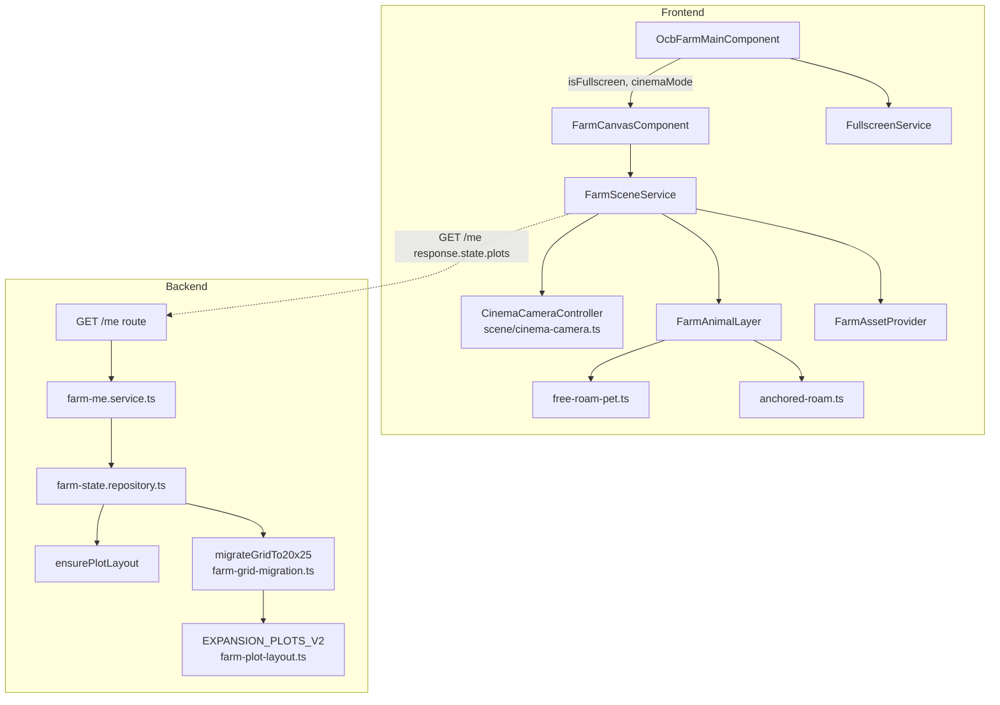
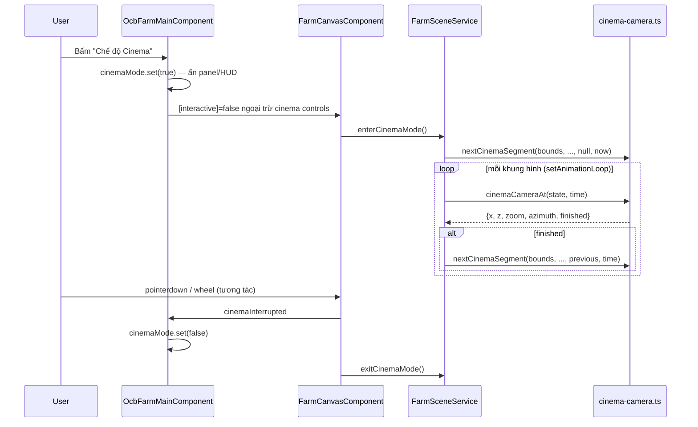

# Design Document — OCB Farm: Nâng cấp Cinema & Mở rộng Nông trại

## Overview

Bản nâng cấp này mở rộng complex-app `ocb-farm` theo 2 trục: **UX hiển thị** (fullscreen, cinema mode) và **mở rộng nội dung 3D** (model mới, chó/mèo tự do, roam cho vật nuôi hiện có, lưới 20×25, CELL_SIZE gấp đôi, scatter mở rộng). Không có business logic kinh tế mới — mọi thay đổi server-side chỉ là **mở rộng dữ liệu lưới** (`state.plots`) theo đúng kiến trúc server-authoritative đã có ở `.kiro/specs/ocb-farm/`.

Nguyên tắc giữ nguyên từ spec gốc:
- **Server-authoritative**: occupancy, inventory, balance vẫn do server quyết định qua `POST /commands`. Roam hiển thị (Anchored_Animal, Free_Roam_Pet) là **client-only, thuần hiển thị**, không có lệnh mới, không đổi `FarmStateJson` ngoài phần `plots` (cho Grid_Migration).
- **Pure function modules**: mọi thuật toán mới (migration lưới, roam path, cinema camera) viết dưới dạng hàm thuần trong `scene/*.ts` hoặc `backend/src/services/ocb-farm/*.ts`, không phụ thuộc Angular/Express/WebGL — dễ test bằng property-based testing.
- **InstancedMesh theo mã hiển thị**: số draw call tỉ lệ theo số *loại* mã, không theo số vật thể hay số ô (trừ vật nuôi có xương, luôn render riêng từng con qua `FarmAnimalLayer`).

### Phạm vi thay đổi theo lớp

| Lớp | Thay đổi |
|---|---|
| Frontend `scene/farm-scene-math.ts` | `CELL_SIZE`, `MAX_ZOOM`, `DEFAULT_MAX_ZOOM`, `MIN_VIEW_CELLS` theo tỉ lệ gấp đôi |
| Frontend `scene/` (mới) | `cinema-camera.ts`, `free-roam-pet.ts`, `anchored-roam.ts` |
| Frontend `services/farm-scene.service.ts` | Tích hợp `CinemaCameraController`, roam cho Anchored_Animal, spawn Free_Roam_Pet |
| Frontend `components/farm-canvas/` | Fullscreen API, nút Cinema_Mode, ẩn HUD |
| Frontend `ocb-farm-main.component.ts/html` | Toggle Fullscreen_Mode/Cinema_Mode, ẩn panel |
| Frontend model | `FarmSpecies` mở rộng `dog`, `cat` (chỉ dùng ở client cho Free_Roam_Pet — KHÔNG xuất hiện trong `state.animals`) |
| Asset | `asset-manifest.json` thêm model cây/bụi/decor mới + `animals.dog`/`animals.cat` (dùng riêng cho layer hiển thị, không qua `BUY_ANIMAL`) |
| Backend `farm-plot-layout.ts` | Bố cục `EXPANSION_PLOTS` mới cho lưới 20×25 + migration từ 13×15 |
| Backend `farm-grid.ts` | Không đổi thuật toán (đã tổng quát theo `plots`), chỉ thêm hằng số kích thước lưới mới |
| Backend `farm-state.repository.ts` | Áp `migrateGridTo20x25` cùng chỗ đang gọi `ensurePlotLayout` |
| Swagger | `GET /me` thêm field `state.grid_version` (number) |

## Architecture

### 1. Fullscreen_Mode

**Quyết định: phần tử fullscreen là `.farm-stage` (div bao `farm-canvas-host` + HUD), không phải riêng `<canvas>`.**

Lý do: Fullscreen API chỉ phóng to đúng phần tử được gọi `requestFullscreen()` — nếu gọi trên `<canvas>` thì các overlay HTML tuyệt đối định vị bên ngoài canvas (nút thoát, HUD) sẽ không hiển thị trong fullscreen. `.farm-stage` (đã có sẵn trong `ocb-farm-main.component.html`, bọc `app-farm-hud` + `farm-canvas-host`) là container đúng để fullscreen toàn bộ khung nhìn 3D + overlay của nó, đồng thời **ẩn phần còn lại** (header, card-header, các panel) bằng cờ `isFullscreen` trên component cha.

DOM hiện tại cần đổi:
```html
<div class="card-body p-0">
  <div class="farm-stage position-relative" #farmStage>
    <!-- đã có: app-farm-hud, farm-canvas-host, overlay -->
  </div>
</div>
```

Khi `isFullscreen() === true`:
- `ocb-farm-main.component.html` ẩn `.card-header` (toolbar nút), tiêu đề `<h4>`, bằng `@if (!isFullscreen())`.
- `.farm-stage` nhận class `farm-stage-fullscreen` (CSS: `width/height: 100%`, nền đen) khi là fullscreen element — trình duyệt tự co giãn theo viewport.
- Một nút thoát duy nhất (`<button class="farm-fullscreen-exit">`) được thêm vào trong `.farm-stage`, hiển thị `@if (isFullscreen())`.
- `app-farm-hud` **vẫn hiển thị** (yêu cầu AC chỉ nói ẩn "panel/HUD/nav khác" — nhưng đọc kỹ AC 1.2 "chỉ hiển thị khung 3D và một nút thoát" nghĩa là HUD cũng ẩn). → Quyết định: ẩn `app-farm-hud` khi fullscreen, chỉ giữ canvas + nút thoát + các nút điều khiển camera cốt lõi của `farm-canvas` (phóng/xoay/về giữa) vì AC 1.5 yêu cầu giữ nguyên cử chỉ **và** các nút đó đã nằm trong `farm-canvas-controls`, là một phần của Farm_Stage, không phải "panel/HUD".

**Service mới**: `services/fullscreen.service.ts` (`providedIn: 'root'`, dùng signal, theo pattern state management của steering):

```typescript
@Injectable({ providedIn: 'root' })
export class FullscreenService {
  private readonly _active = signal(false);
  private readonly _unsupported = signal(false);
  readonly active = this._active.asReadonly();
  readonly unsupported = this._unsupported.asReadonly();

  constructor() {
    const handler = () => this._active.set(document.fullscreenElement !== null);
    document.addEventListener('fullscreenchange', handler);
    inject(DestroyRef).onDestroy(() => document.removeEventListener('fullscreenchange', handler));
  }

  async enter(el: HTMLElement): Promise<boolean> {
    if (!el.requestFullscreen) { this._unsupported.set(true); return false; }
    try { await el.requestFullscreen(); return true; }
    catch { this._unsupported.set(true); return false; }
  }

  async exit(): Promise<void> {
    if (document.fullscreenElement) await document.exitFullscreen();
  }
}
```

- `fullscreenchange` listener là nguồn chân lý duy nhất cho `_active` → giải quyết AC 1.6 (thoát do Esc/OS): mọi đường thoát (nút, Esc trong trang, Esc do OS, chuyển app trên một số trình duyệt) đều đi qua event này, cờ luôn đồng bộ đúng theo `document.fullscreenElement`.
- `enter()`/`exit()` không tự đặt `_active` — chỉ `fullscreenchange` làm điều đó, tránh hai nguồn chân lý lệch nhau.
- `_unsupported` dùng để hiển thị thông báo tiếng Việt (AC 1.4), tự reset về `false` ở lần `enter()` kế tiếp.

### 2. Cinema_Mode

**`CinemaCameraController`** là hàm thuần (file `scene/cinema-camera.ts`), không phụ thuộc three.js trực tiếp ở phần tính toán — chỉ làm việc với số (target x/z, zoom, azimuth) để dễ test property-based. `FarmSceneService` áp kết quả vào camera thật mỗi khung hình, tái dùng đúng pattern `rotateAnim`/`cameraDirty`/`lerpAngle` đã có.

```typescript
// scene/cinema-camera.ts
export interface CinemaBounds { minCol: number; maxCol: number; minRow: number; maxRow: number }
export interface CinemaSegment {
  fromX: number; fromZ: number; fromZoom: number; fromAzimuth: number;
  toX: number; toZ: number; toZoom: number; toAzimuth: number;
  durationMs: number;
}
export interface CinemaState {
  segment: CinemaSegment;
  /** Thời điểm thực (performance.now() / Date.now()) khi segment hiện tại bắt đầu. */
  startedAtMs: number;
}

/** Sinh segment kế tiếp — không lặp y nguyên segment vừa xong (AC 2.3). */
export function nextCinemaSegment(
  bounds: CinemaBounds,
  minZoom: number,
  maxZoom: number,
  previous: CinemaSegment | null,
  nowMs: number,
  rand: () => number = Math.random,
): CinemaSegment { /* ... chọn target/zoom/azimuth random, retry nếu == previous.to* ... */ }

/** Vị trí nội suy tại `nowMs` — easing out cubic, giống `easeOutCubic` hiện có. */
export function cinemaCameraAt(state: CinemaState, nowMs: number): {
  x: number; z: number; zoom: number; azimuth: number; finished: boolean
} { /* t = clamp((nowMs - startedAtMs) / durationMs, 0, 1); ease; lerp từng trường */ }
```

Điểm thiết kế quan trọng (giải quyết yêu cầu kỹ thuật #2 của người dùng):

- **Target ngẫu nhiên**: `nextCinemaSegment` chọn một `(row, col)` ngẫu nhiên **trong `bounds` của vùng đã mở** (tái dùng `GridBounds` đã có ở `farm-scene-math.ts`, nhưng tính riêng từ các `plot.unlocked === true` thay vì toàn lưới — xem `cinemaBoundsFromPlots(plots)` mới, loại các ô bị khoá để camera không bay ra vùng tối).
- **Zoom ngẫu nhiên trong [min, max]**: dùng `[DEFAULT_MAX_ZOOM * 0.5, maxZoom]` của farm hiện tại (không vượt `maxZoom` đã tính theo kích thước farm) để luôn thấy được vật thể.
- **Azimuth ngẫu nhiên**: không giới hạn 4 góc 90° như `rotate()` — chọn liên tục trong `[0, 2π)` để chuyển động "quay phim" mượt hơn là nhảy góc.
- **Không dùng `requestAnimationFrame` thô / không đếm theo số khung hình đã qua**: `CinemaState.startedAtMs` lưu **mốc thời gian thực** (truyền vào từ `performance.now()` tại thời điểm `frame()` gọi, giống cách `rotateAnim.start` đã dùng `time` của `setAnimationLoop`). `cinemaCameraAt` tính `t` bằng **hiệu số timestamp hiện tại trừ mốc bắt đầu**, KHÔNG cộng dồn `dt` mỗi khung hình. Điều này giải quyết trực tiếp AC 2.9: khi tab bị throttle (background), `setAnimationLoop` ngừng gọi `frame()`, nhưng khi tab focus lại, `time` (timestamp của khung hình mới) đã nhảy xa — `t = (time - startedAtMs) / durationMs` sẽ tự động vượt 1 (hoặc rất gần 1), `finished = true` được phát hiện ngay, controller chuyển sang segment kế tiếp một cách tự nhiên, **không có khung hình nào "nhảy cóc" nội suy sai** vì không có state tích lũy theo số frame.
- Khác với `elapsed` (biến đếm cộng dồn `dt` đã clamp bởi `MAX_FRAME_DT`, dùng cho hiệu ứng tuần hoàn như sway/breathing — không quan trọng độ trễ tuyệt đối), cinema camera **phải** dùng wall-clock thật vì mốc "segment bắt đầu lúc nào" cần tuyệt đối, không tương đối theo số khung hình đã vẽ.

**Tích hợp vào `FarmSceneService`**:
```typescript
private cinema: CinemaState | null = null;
private readonly _cinemaActive = signal(false);
readonly cinemaActive = this._cinemaActive.asReadonly();

enterCinemaMode(): void {
  if (!this.bounds) return;
  const b = this.cinemaBoundsFromUnlockedPlots();
  this.cinema = { segment: nextCinemaSegment(b, DEFAULT_MAX_ZOOM * 0.5, this._maxZoom(), null, performance.now()), startedAtMs: performance.now() };
  this._cinemaActive.set(true);
}
exitCinemaMode(): void { this.cinema = null; this._cinemaActive.set(false); }
```
Trong `frame(time)`: nếu `this.cinema`, gọi `cinemaCameraAt(this.cinema, time)` thay cho đọc `this.target`/`this._zoom`/`this.azimuth` trực tiếp — ghi kết quả vào `this.target`, gọi `this.setZoom(...)` nội bộ (bỏ qua clamp UI thông thường vì zoom cinema tự tính trong biên hợp lệ), và set `this.azimuth` trực tiếp (không qua `rotateAnim`, cinema có azimuth liên tục không theo 4 góc 90°) rồi `this.cameraDirty = true`. Khi `finished`, sinh segment kế tiếp bằng `nextCinemaSegment(..., previous: this.cinema.segment, ...)`.

**Không gửi lệnh / không đổi state (AC 2.7)**: `CinemaCameraController` chỉ đọc `this.bounds` (đã có từ terrain) và ghi `this.target`/`this.camera` — không bao giờ gọi `FarmStateStore.dispatch`, không có tham chiếu tới `state`/`version`/`balance`. Vì đây thuần là biến instance của `FarmSceneService` tách biệt hoàn toàn khỏi `FarmStateStore`, bất biến này tự nhiên theo kiến trúc (không có đường gọi).

**Tương tác thoát Cinema_Mode (AC 2.5)**: `farm-canvas.component.ts` đã có `attachControls` lắng nghe `pointerdown`/`wheel` — thêm một output `cinemaInterrupted` phát khi `onPointerDown`/`onWheel` xảy ra trong lúc `scene.cinemaActive()`, container gọi `exitCinemaMode()` + khôi phục UI thường.

**UI Cinema_Mode**: khác Fullscreen_Mode, Cinema_Mode không gọi Fullscreen API (đây là "Picture-in-Picture tự dựng" của riêng app, không phải Document PiP). Component cha thêm signal `cinemaMode = signal(false)`; khi `true`, template ẩn toàn bộ: `.card-header`, `app-farm-hud`, mọi panel, chỉ còn `.farm-stage` + 1 nút thoát nổi trên canvas. Cinema_Mode và Fullscreen_Mode độc lập, có thể bật cùng lúc (fullscreen + cinema).

### 3. Model 3D mới từ poly.pizza

**Mở rộng Asset_Manifest schema**: schema hiện tại (`animals`, `plants`, `decors`) đã đủ tổng quát — `decors` nhận bất kỳ `DecorKind` (string tự do, đã hỗ trợ `tree_*`, `bush_*`, `flowerbed_*` qua `decorGroupOf`). **Không cần đổi cấu trúc schema**, chỉ cần:
1. Thêm 2 entry mới vào `animals`: `dog`, `cat` (cùng cấu trúc `files.low/medium/high`, `fallback_color`, `variants?`) — dùng bởi `FarmAnimalLayer` qua `animalRenderKey('dog' as FarmSpecies)` giống loài hiện có, NHƯNG **`dog`/`cat` không được thêm vào `FARM_SPECIES` dùng cho `state.animals`** (xem mục 4) — union kiểu riêng `FarmFreeRoamSpecies = 'dog' | 'cat'` ở frontend-only.
2. Thêm entry mới vào `decors` cho mỗi model cây/bụi/decor mới, đặt tên theo quy ước nhóm đã có (`decorGroupOf` lấy phần trước `_` đầu tiên).

**Danh sách model đề xuất tải (ánh xạ vào nhóm render hiện có)**:

| Mã hiển thị mới | Nhóm render | Nguồn poly.pizza (gợi ý tìm) | Ghi chú |
|---|---|---|---|
| `decor:tree_pine` | `decor:tree_*` (sway 0.025) | "pine tree low poly" | Cây lá kim trang trí |
| `decor:tree_oak` | `decor:tree_*` | "oak tree low poly" | Cây lá rộng |
| `decor:bush_round` | `decor:bush_*` (sway 0.04) | "bush low poly" | Bụi cây tròn |
| `decor:bush_berry` | `decor:bush_*` | "berry bush low poly" | Bụi có quả đỏ |
| `decor:flowerbed_tulip` | `decor:flowerbed_*` (sway 0.06, trừ `*petal*`) | "tulip flower bed low poly" | Luống hoa tulip |
| `decor:lamp_garden` | `lamp` (đã có nhóm `lamp`) | "garden lamp post low poly" | Đèn trang trí mới |
| `animal:dog` | `animal` (qua `FarmAnimalLayer`, có xương) | "dog low poly rigged" | Free_Roam_Pet |
| `animal:cat` | `animal` (qua `FarmAnimalLayer`, có xương) | "cat low poly rigged" | Free_Roam_Pet |

Mỗi mã cần 3 file (`_low`/`_medium`/`_high`), nén Draco theo pipeline build hiện có (`angular.json` đã cấu hình chép decoder).

**Quy trình kiểm giấy phép** (checklist ghi vào `ASSET-LICENSES.md`, cột tương ứng dòng mới):

| Bước | Nội dung kiểm | Hành động nếu không đạt |
|---|---|---|
| 1 | Model có giấy phép CC0, CC-BY, hoặc "Free for commercial use" trên poly.pizza? | Không tải — chọn model khác |
| 2 | Nếu CC-BY: có yêu cầu ghi công (attribution) tên tác giả? | Thêm dòng ghi công vào trang trợ giúp app (xem `ASSET-LICENSES.md` hiện có — mục ghi công) |
| 3 | Nếu không đặt được ghi công ở trang trợ giúp (ví dụ do giới hạn UI) | Loại khỏi dự án theo AC 3.4, không khai báo vào manifest |
| 4 | Model có rigging (xương) sẵn nếu dùng cho `animal:*`? | Nếu không có → chỉ dùng cho `decor:*` (instancing tĩnh + sway), không gán vào `FarmAnimalLayer` |
| 5 | Dung lượng từng file (`_low/_medium/_high`) có hợp lý trong ngân sách? | Xem mục Hiệu năng — nếu vượt, nén thêm hoặc giảm poly count trước khi nhận |
| 6 | Ghi dòng vào `ASSET-LICENSES.md`: tên asset, nguồn tải, tên giấy phép, ngày tải, yêu cầu ghi công, mã manifest tương ứng | — |

### 4. Free_Roam_Pet (chó/mèo)

**Quyết định kiến trúc**: Free_Roam_Pet là **client-only, không có id server, khởi tạo lại mỗi lần load scene với seed theo `userId`** (ổn định qua các lần tải lại trong cùng phiên nông trại của một nhân viên, nhưng độc lập hoàn toàn với `FarmStateJson`). Lý do chọn seed theo `userId` thay vì ngẫu nhiên thuần: để vị trí ban đầu không "nhảy" mỗi lần nhân viên F5 trang (UX ổn định hơn), nhưng vẫn khác nhau giữa các nhân viên khác nhau — tái dùng `stableHash` đã có ở `farm-asset-provider.ts`.

**Module mới**: `scene/free-roam-pet.ts` (hàm thuần):

```typescript
export interface FreeRoamPetSpawn {
  id: string; // sinh cục bộ, ví dụ `pet:dog:0`, ổn định trong phiên
  species: 'dog' | 'cat';
  cell: FarmCellRef; // vị trí hiển thị hiện tại — KHÔNG dùng cho occupancy
}

export interface FreeRoamPetConfig { countPerSpecies: number } // mặc định { countPerSpecies: 1 } → 1 chó + 1 mèo

/** Spawn ban đầu — tất định theo userId + species, chọn ô ngẫu nhiên trong vùng mở, loại ô trung tâm. */
export function initialFreeRoamPets(
  plots: readonly FarmPlot[],
  centerCell: FarmCellRef | null,
  userId: number,
  config: FreeRoamPetConfig = { countPerSpecies: 1 },
): FreeRoamPetSpawn[] { /* seededRandom(stableHash(`${userId}|pet`)) chọn ô unlocked land, != centerCell */ }

/** Chọn ô đích kế tiếp — bất kỳ ô ĐÃ MỞ nào trên lưới (không giới hạn lân cận), loại ô khoá/ô cây (AC 4.2, 4.5). */
export function nextFreeRoamTarget(
  plots: readonly FarmPlot[],
  centerCell: FarmCellRef | null,
  rand: () => number = Math.random,
): FarmCellRef | null { /* lọc plot.unlocked && terrain==='land', != centerCell, chọn ngẫu nhiên 1 cell */ }
```

- **Pathing qua nhiều ô liên tiếp**: khác `FarmAnimalLayer.enterMove` (di chuyển trong bán kính `roam` quanh 1 ô neo), Free_Roam_Pet di chuyển **thẳng** từ vị trí hiện tại tới `targetCell` bất kỳ trên lưới (có thể cách nhiều ô) — tái dùng toàn bộ cơ chế `stepMove`/`heading`/`clips.walk`/`clips.run` của `FarmAnimalLayer` (AC 4.3), chỉ khác ở nguồn tạo `targetX/targetZ` (toàn lưới, không bị giới hạn bởi `homeX/homeZ ± roam`).
- **Tích hợp vào `FarmSceneService`**: `FarmAnimalLayer` được mở rộng để nhận một **danh sách spawn phụ** (Free_Roam_Pet) song song với spawn từ `state.animals` — xem mục kiến trúc chung ở phần "Mở rộng FarmAnimalLayer" dưới đây. Vì `AnimalActor.homeX/homeZ` hiện là "tâm roam cố định", Free_Roam_Pet cần một actor **không có home cố định** — khi tới đích, `homeX/homeZ` được **cập nhật lại thành vị trí mới** trước khi chọn đích kế tiếp (khác Anchored_Animal, nơi `homeX/homeZ` không đổi).
- **Không lưu `state.animals` (AC 4.4)**: `groupEntities()`/`syncAll()` trong `FarmSceneService` không bao giờ đọc Free_Roam_Pet từ `state` — chúng được giữ trong một field riêng `private freeRoamSpawns: FreeRoamPetSpawn[]`, khởi tạo một lần trong `syncTerrain()` (khi biết `plots`/`centerCell` lần đầu) và không bị ghi đè bởi `setState()`.

### 5. Anchored_Animal roam quanh Anchor_Cell

**Vấn đề cốt lõi**: `animalLayer.pick()` raycast vào `actor.hit` (hộp va chạm đi theo `actor.root.position`, tức vị trí **hiển thị**). Khi Anchored_Animal roam ra khỏi Anchor_Cell, `actor.root.position` lệch khỏi `Anchor_Cell`, nhưng `pick()` **đã luôn** trả về `id` (không trả về cell) — xem `FarmAnimalLayer.pick()`:
```typescript
pick(raycaster: Raycaster): { id: string; distance: number } | null {
  const id = first.object.userData['animalId'] as string | undefined;
  return id ? { id, distance: first.distance } : null;
}
```
và `FarmSceneService.pickAt()` map `id` → `cell` qua **`this.animalSpawns.get(animalHit.id)`**, KHÔNG qua `actor.root.position`:
```typescript
const spawn = this.animalSpawns.get(animalHit.id);
if (spawn) return { kind: 'entity', entityKind: 'animal', id: spawn.id, cell: spawn.cell };
```
→ **Cơ chế hiện tại đã đúng theo yêu cầu AC 5.6** miễn là `this.animalSpawns.get(id).cell` luôn bằng `Anchor_Cell` của server (`FarmAnimal.cell` từ `state.animals`), **không bị gán nhầm thành vị trí hiển thị roam**. Thiết kế roam phải tuân thủ nghiêm ngặt: **không bao giờ ghi đè `animalSpawns.get(id).cell`** bằng vị trí roam — `cell` trong `FarmAnimalSpawn` tiếp tục là `Anchor_Cell` thuần (dùng cho menu/raycast mapping), còn vị trí hiển thị roam là một trường **mới, tách biệt**, không đi qua `cell`.

**Thiết kế cụ thể**:

1. `FarmAnimalSpawn` (trong `farm-animal-layer.ts`) **giữ nguyên `cell = Anchor_Cell`** (không đổi field hiện có — tránh phá vỡ hợp đồng `pickAt`/menu tương tác đang dùng `spawn.cell`).
2. `AnimalActor.homeX/homeZ` **tiếp tục là tâm Anchor_Cell** (không đổi, khác với Free_Roam_Pet) — đây chính là cơ chế roam "quanh anchor" tự nhiên có sẵn: `enterMove()` đã chọn điểm ngẫu nhiên trong bán kính `MOTION[species].roam * CELL_SIZE` quanh `homeX/homeZ`. **Không cần thêm cơ chế mới cho việc "di chuyển quanh Anchor_Cell"** — hành vi này **đã tồn tại** trong `FarmAnimalLayer` từ spec gốc (bán kính nhỏ, trong 1 ô). Yêu cầu mới (US-5) chỉ mở rộng **bán kính roam** từ "trong 1 ô" sang "các ô lân cận" (nhiều ô).
3. **Thay đổi cần làm**: tăng giá trị `roam` trong `MOTION` cho 6 loài hiện có (từ ví dụ `0.32 ô` lên `Roam_Radius` ô — xem Data Models) **và** thêm kiểm tra ranh giới: điểm đích ngẫu nhiên của `enterMove()` phải nằm trong **ô đã mở khóa cùng loại địa hình hợp lệ** (AC 5.2), không chỉ là một hình tròn hình học. Đây là thay đổi logic thật trong `enterMove()`:
```typescript
// scene/anchored-roam.ts (hàm thuần, test được độc lập)
export function clampRoamTarget(
  homeCell: FarmCellRef, candidateX: number, candidateZ: number,
  plots: readonly FarmPlot[], species: FarmSpecies, occupiedByOthers: readonly FarmCellRef[],
): { x: number; z: number } {
  // 1. Quy đổi (candidateX, candidateZ) → cell gần nhất (worldToCell).
  // 2. Nếu cell đó không unlocked, hoặc terrain sai loài, hoặc nằm trong occupiedByOthers
  //    (Anchor_Cell của một Anchored_Animal KHÁC) → trả về toạ độ homeCell (đứng yên tại anchor).
  // 3. Ngược lại trả nguyên (candidateX, candidateZ).
}
```
4. **AC 5.4 (tránh 2 vật thể cùng vị trí hiển thị)**: `clampRoamTarget` nhận `occupiedByOthers` = tập `Anchor_Cell` của mọi Anchored_Animal/entity khác (không phải vị trí roam hiện tại của chúng — việc tránh va chạm *động* giữa hai con đang roam cùng lúc là một bài toán phức tạp hơn không cần giải ở mức "thuần hiển thị, decoration"; tránh va chạm với các **Anchor_Cell cố định** đã đủ để không có 2 vật thể "chiếm chỗ" cùng ô theo đúng ngữ nghĩa AC 5.4 — việc 2 con đang di chuyển "lướt qua nhau" tạm thời không vi phạm AC vì AC nói về "chiếm chỗ" (occupy), không phải va chạm hình học tức thời).
5. `FarmSceneService.groupEntities()` cần truyền thêm `plots`/`occupiedCells` vào `FarmAnimalLayer.sync()` để actor có đủ thông tin gọi `clampRoamTarget` mỗi khi `enterMove()` — chữ ký `sync()` mở rộng:
```typescript
sync(
  spawns: readonly FarmAnimalSpawn[],
  templateOf: (key: string) => Object3D | null,
  roamContext: { plots: readonly FarmPlot[] }, // mới — đủ để tính terrain + unlocked + anchor khác
): Set<string>
```

**AC 5.5 (lệnh dùng Anchor_Cell, không dùng vị trí hiển thị)**: đã đúng theo kiến trúc hiện có — mọi lệnh (`FEED_ANIMAL`, `HARVEST_ANIMAL`, `SELL_ANIMAL`) dùng `animal_id` (không dùng `cell`) trong payload, và menu tương tác (`entity-action-menu`) được mở từ `FarmEntityPick.id` (lấy qua `pickAt` → `animalSpawns.get(id).cell` = Anchor_Cell, chỉ dùng để hiển thị, không gửi lên server). Không cần thay đổi.

### 6. Mở rộng animation cho model mới

Không có thay đổi thuật toán — `buildClips()`/máy trạng thái hành vi (`idle/walk/run/eat/react`) trong `FarmAnimalLayer` đã nhận diện clip theo **tên clip** (regex), không theo loài, nên `dog`/`cat` tự động dùng cùng cơ chế miễn là file GLB có clip tên tương tự bộ Quaternius (`Walk`, `Run`, `Idle`, `Eat`...) hoặc rơi vào nhánh dự phòng thủ tục (hop/bob) nếu thiếu clip. `MOTION` (bảng tốc độ/roam/trọng số hành vi theo loài) cần thêm 2 dòng:

```typescript
const MOTION: Readonly<Record<FarmSpecies | FarmFreeRoamSpecies, SpeciesMotion>> = {
  // ...6 loài hiện có...
  dog: { speed: 0.14, roam: 999 /* không dùng — free roam dùng target toàn lưới */, idleMin: 0.8, idleMax: 2.5, weights: [5, 2, 1, 2] },
  cat: { speed: 0.11, roam: 999, idleMin: 1.0, idleMax: 3.0, weights: [4, 1.5, 1, 3] },
};
```
`swayAmplitude()` (trong `farm-scene.service.ts`) đã tổng quát theo tiền tố nhóm (`decor:tree_*` → 0.025, `decor:bush_*` → 0.04, `decor:flowerbed_*` không chứa `petal` → 0.06) — mã mới (`tree_pine`, `tree_oak`, `bush_round`, `bush_berry`, `flowerbed_tulip`) tự động nhận đúng biên độ theo nhóm, không cần sửa hàm.

### 7. Grid 20×25 + CELL_SIZE gấp đôi

**Giá trị cụ thể**:

| Hằng số | Giá trị cũ | Giá trị mới | Công thức |
|---|---|---|---|
| `CELL_SIZE` | 10 | **20** | ×2 theo AC 9.1 |
| `MAX_ZOOM` (trần cứng) | 40 | **40** (không đổi — là hệ số zoom, không phụ thuộc đơn vị thế giới) | `camera.zoom` là tỉ lệ phóng của `OrthographicCamera`, không phải đơn vị dài — tăng `CELL_SIZE` không làm đổi "độ phóng tối đa có ý nghĩa" |
| `DEFAULT_MAX_ZOOM` | 8 | **8** (không đổi) | Tương tự — là hệ số zoom tối thiểu đảm bảo nhìn rõ vật nuôi, độc lập đơn vị |
| `MIN_VIEW_CELLS` | 1.2 | **1.2** (không đổi) | Đơn vị là "số ô", không phụ thuộc `CELL_SIZE` — `updateMaxZoom()` đã tính `frustumSize / (MIN_VIEW_CELLS * CELL_SIZE)`, công thức tự động co giãn đúng theo `CELL_SIZE` mới vì `frustumSize` cũng tính theo `CELL_SIZE` (`fitFrustumAndShadow`) |

**Giải thích AC 9.2 (giữ tỉ lệ cảm giác zoom)**: Property đã nêu ở Correctness Properties — vì `updateMaxZoom()` dùng `frustumSize / (MIN_VIEW_CELLS * CELL_SIZE)` và `frustumSize` cũng được tính từ `span * CELL_SIZE` (trong `fitFrustumAndShadow`), tỉ lệ `frustumSize / CELL_SIZE` **không đổi** khi `CELL_SIZE` nhân đôi (cả tử và mẫu cùng nhân theo `CELL_SIZE`) — nghĩa là **không cần sửa `MAX_ZOOM`/`DEFAULT_MAX_ZOOM`/`MIN_VIEW_CELLS`**, chỉ cần sửa `CELL_SIZE` duy nhất, mọi công thức phụ thuộc đã tự co giãn đúng theo thiết kế gốc (đây là lý do các hằng số này được viết độc lập đơn vị dài ngay từ đầu). Quyết định: **chỉ đổi `CELL_SIZE = 20`**, giữ nguyên `MAX_ZOOM`, `DEFAULT_MAX_ZOOM`, `MIN_VIEW_CELLS`.

**Cấu trúc file định nghĩa `plots` cho lưới 20×25** (`backend/src/services/ocb-farm/farm-plot-layout.ts`):

Lưới 13×15 hiện tại (tính từ `EXPANSION_PLOTS` + vùng 1): hàng từ -4 đến 10 (15 hàng), cột từ -4 đến 10 (15 cột) — thực chất là ~15×15 chứ không chính xác 13×15 theo nghĩa "khung chữ nhật đặc", vì bố cục hiện tại là các dải bất đối xứng quanh vùng khởi đầu (không phải hình chữ nhật đầy). Để đạt đúng **20×25 ô, phủ hết 500 ô** (AC 7.4 — "chứa đủ số vùng để phủ hết toàn bộ 500 ô"), thiết kế lưới mới theo **cùng phong cách dải mở rộng đồng tâm**, giữ nguyên tỉ lệ vị trí vùng khởi đầu:

```typescript
// farm-plot-layout.ts — bố cục mới (ví dụ cụ thể, giữ nguyên quy ước centerCell = "2,2")
// Vùng 1 (khởi đầu): khối 5×5 "0,0".."4,4" — KHÔNG đổi (giữ nguyên vị trí Cây OCB tương đối).
// Mở rộng tỉ lệ theo hướng để đạt khung tổng 20 hàng × 25 cột, ví dụ:
//   hàng: -7..12 (20 hàng), cột: -9..15 (25 cột)
export const EXPANSION_PLOTS_V2: readonly FarmPlot[] = [
  { id: 2, unlocked: false, terrain: 'land', cells: block(0, 4, 5, 10) },   // đông
  { id: 3, unlocked: false, terrain: 'land', cells: block(5, 8, 0, 10) },   // nam
  { id: 4, unlocked: false, terrain: 'land', cells: block(0, 8, -4, -1) },  // tây
  { id: 5, unlocked: false, terrain: 'land', cells: block(-4, -1, -4, 10) },// bắc
  { id: 6, unlocked: false, terrain: 'land', cells: block(-4, 8, 11, 13) }, // đông ngoài
  { id: 8, unlocked: false, terrain: 'water', cells: block(9, 10, 0, 4) }, // ao mở rộng
  { id: 9, unlocked: false, terrain: 'land', cells: block(9, 10, 5, 13) },
  { id: 10, unlocked: false, terrain: 'land', cells: block(-4, 10, 14, 15) },
  { id: 11, unlocked: false, terrain: 'land', cells: block(9, 10, -6, -1) },
  { id: 12, unlocked: false, terrain: 'land', cells: block(-4, 8, -6, -5) },
  { id: 13, unlocked: false, terrain: 'land', cells: block(-6, -5, -6, 15) },
  { id: 14, unlocked: false, terrain: 'water', cells: block(11, 12, 0, 4) },
  { id: 15, unlocked: false, terrain: 'land', cells: block(-7, -7, -9, 15) }, // vùng bổ sung phủ đủ 20×25
  { id: 16, unlocked: false, terrain: 'land', cells: block(-7, 12, -9, -7) },
  // ... (số vùng/toạ độ chính xác được tinh chỉnh ở lúc code để đảm bảo UT 7.4 "phủ đủ 500 ô, không chồng lắp" pass)
];
```
Việc tinh chỉnh toạ độ chính xác từng vùng để **tổng đúng 500 ô không trùng/không thiếu** là chi tiết triển khai (task sẽ viết unit test duyệt toàn bộ 500 ô để xác nhận) — thiết kế chỉ cố định **nguyên tắc**: vùng 1 (5×5, chứa ô trung tâm `"2,2"`) không đổi vị trí tương đối (vẫn là góc trên-trái của toàn khung, giữ đúng tỉ lệ như lưới 13×15 nơi vùng 1 cũng ở góc trên-trái của khung dải), các vùng mở rộng còn lại là các dải đồng tâm bao quanh theo đúng thứ tự kề nhau (`canExpandPlot` không đổi).

**`farm-grid.ts` không cần sửa** — các hàm `canPlace`/`canExpandPlot`/`centerCell` đều nhận `plots`/`cell` làm input, không hardcode kích thước lưới.

### 8. Grid_Migration

**Quyết định: lazy migration trong `farm-state.repository.ts`, cùng chỗ đang gọi `ensurePlotLayout`** — không dùng migration script một lần chạy khi deploy, vì:
1. Đã có đúng pattern này cho `EXPANSION_PLOTS` (mở rộng 7→14 vùng) — thêm một bước nữa vào cùng pipeline nhất quán với kiến trúc hiện có.
2. Migration script một lần yêu cầu downtime/thao tác vận hành thủ công — vi phạm "không yêu cầu nhân viên hoặc vận hành viên xác nhận/thao tác thủ công" (Out of Scope).
3. Lazy migration tự nhiên idempotent nếu viết đúng (không ghi gì nếu đã đúng dạng).

**Heuristic nhận diện Legacy_Grid_Farm**: thêm field `grid_version` vào `FarmStateJson` (schema JSONB, không cần migration SQL vì JSONB tự do — giống cách `renames?: string[]` được thêm ở spec gốc "không cần migration vì nằm trong JSONB"). State cũ không có `grid_version` (hoặc `grid_version < 2`) → coi là Legacy_Grid_Farm.

```typescript
// backend/src/types/ocb-farm.types.ts — mở rộng FarmStateJson
export interface FarmStateJson {
  schema: number;
  /** Phiên bản lưới — thiếu hoặc < 2 nghĩa là lưới 13×15 cũ (US-7, US-8 nâng cấp). */
  grid_version?: number; // 2 = lưới 20×25, CELL_SIZE mới
  plots: FarmPlot[];
  // ... không đổi các field khác
}

// backend/src/services/ocb-farm/farm-grid-migration.ts (MỚI — hàm thuần)
export const CURRENT_GRID_VERSION = 2;

export function migrateGridTo20x25(state: FarmStateJson): FarmStateJson {
  if ((state.grid_version ?? 1) >= CURRENT_GRID_VERSION) return state; // idempotent (AC 8.6)
  // 1. Giữ nguyên MỌI plot đã có (id, unlocked, cells, terrain) — không đổi (AC 8.2, 8.3).
  // 2. Thêm các plot mới từ EXPANSION_PLOTS_V2 có id chưa tồn tại VÀ cells chưa bị chiếm
  //    (cùng logic `ensurePlotLayout` hiện có — lọc theo `used` set).
  const ids = new Set(state.plots.map((p) => p.id));
  const used = new Set(state.plots.flatMap((p) => p.cells));
  const missing = EXPANSION_PLOTS_V2.filter((p) => !ids.has(p.id) && p.cells.every((c) => !used.has(c)));
  return {
    ...state,
    grid_version: CURRENT_GRID_VERSION,
    plots: [...state.plots, ...missing.map((p) => ({ ...p, cells: [...p.cells] }))].sort((a, b) => a.id - b.id),
  };
}
```

**Áp dụng**: trong `farm-state.repository.ts`, nối tiếp `ensurePlotLayout` hiện có:
```typescript
state: migrateGridTo20x25(ensurePlotLayout(row.state)),
```
(cả hai hàm đều thuần, idempotent, không IO — thứ tự áp dụng không ảnh hưởng kết quả cuối vì `migrateGridTo20x25` chỉ thêm `plots` có id chưa tồn tại, giống `ensurePlotLayout`). Áp dụng ở **cả `readFarmState` và `readFarmStateForUpdate`** (hai hàm đọc đều phải thấy cùng dữ liệu đã migrate, để lệnh ghi — ví dụ `EXPAND_PLOT` — hoạt động đúng trên lưới đã mở rộng).

**Không cần migration SQL**: `state`/`settings` là cột JSONB tự do (`farm_states.state JSONB`) — không có constraint schema SQL cần `ALTER TABLE`. Vì chỉ thêm field tùy chọn trong JSONB, không cần file `.sql` mới theo quy tắc "Database File Convention" (quy tắc đó áp dụng cho thay đổi *schema bảng*, không áp dụng cho nội dung JSONB).

**Thế giới hiển thị sau migration (AC 8.7)**: không cần xử lý riêng — `cellToWorld(coord)` dùng `CELL_SIZE` toàn cục cho mọi `cell` (cũ hay mới), nên vật thể cũ (toạ độ `"2,2"` v.d.) tự động vẽ đúng vị trí theo `CELL_SIZE` mới, nhất quán với lưới mới (không có "world position cũ" được lưu — chỉ lưu `cell`, world position luôn tính lại).

### 9. Backend changes (tổng hợp)

| File | Thay đổi |
|---|---|
| `backend/src/types/ocb-farm.types.ts` | Thêm `grid_version?: number` vào `FarmStateJson` |
| `backend/src/services/ocb-farm/farm-plot-layout.ts` | Thêm `EXPANSION_PLOTS_V2` (lưới 20×25), giữ nguyên `EXPANSION_PLOTS` (lưới 13×15 cũ, dùng bởi `ensurePlotLayout` cho tương thích) |
| `backend/src/services/ocb-farm/farm-grid-migration.ts` | **File mới** — `migrateGridTo20x25`, `CURRENT_GRID_VERSION` |
| `backend/src/services/ocb-farm/farm-state.repository.ts` | Gọi `migrateGridTo20x25` sau `ensurePlotLayout` ở `readFarmState`/`readFarmStateForUpdate` |
| `backend/src/services/ocb-farm/farm-init.service.ts` | `buildInitialFarmStateJson` dùng `EXPANSION_PLOTS_V2` qua `ensurePlotLayout` mới (nông trại mới tạo thẳng ở `grid_version: 2`, không cần migrate) |
| `backend/src/services/ocb-farm/farm-grid.ts` | **Không đổi** (đã tổng quát theo `plots`) |
| Migration SQL | **Không cần** — `grid_version` nằm trong JSONB |
| Swagger (`backend/src/swagger/tags/ocb-farm.yaml` hoặc tương đương) | `GET /me` response schema: thêm `state.grid_version` (integer, optional) vào `components/schemas.yaml` phần `FarmStateJson` |

### 10. Hiệu năng

| Hạng mục | Giới hạn đề xuất | Lý do |
|---|---|---|
| Số `InstancedMesh` batch (vật thể tĩnh: plant/decor theo mã) | Không đổi nguyên tắc — tỉ lệ theo **số mã hiển thị khác nhau đang có trên nông trại** (hiện tại ~15-20 mã tối đa với plant×5 giai đoạn×3 loại + decor). Thêm 5 mã decor mới (`tree_pine`, `tree_oak`, `bush_round`, `bush_berry`, `flowerbed_tulip`) → batch tăng tối đa **+5**, không phụ thuộc số ô (195→500) hay số lượng từng vật thể | Giữ đúng kiến trúc instancing hiện có (Property 11.1/11.2) |
| Số model động (`FarmAnimalLayer`) tối đa, gồm Free_Roam_Pet | Đề xuất **trần 16 con/nông trại** (6 loài hiện có × giới hạn `FarmLimits.animals.max` hiện có, cộng cố định **+2** cho Free_Roam_Pet — 1 chó + 1 mèo, không đổi theo cấu hình). Mỗi actor có xương là 1 draw call riêng + 1 `AnimationMixer` — chi phí tuyến tính theo số con, không theo loại | `FarmLimits.animals` (US-37) đã giới hạn vật nuôi thật qua server; Free_Roam_Pet cộng thêm cố định không qua giới hạn này (XN-5 giả định không tính limit) nhưng số lượng **cố định nhỏ (2)** nên không ảnh hưởng ngân sách |
| Ngân sách tải lần đầu (`initial_budget_bytes`) | Hiện tại **8 MB** (8388608 bytes). Đề xuất tăng lên **12 MB (12582912 bytes)** | Thêm `animal:dog`, `animal:cat` vào tập `initial: true` (Free_Roam_Pet phải sẵn sàng ngay khi mở nông trại — AC 4.1 "đã mở ít nhất một vùng" là điều kiện gần như luôn đúng ngay từ đầu) cộng thêm ~2-3 MB (2 model có xương, mức `low`); các cây/bụi/hoa mới (`tree_pine`, `tree_oak`, `bush_round`, `bush_berry`, `flowerbed_tulip`) đặt `initial: false` (tải nền sau, giống cách các biến thể `variants` hiện tại không nằm trong tập `initial`) để không đội ngân sách tải đầu quá nhiều — chỉ `dog`/`cat` là bắt buộc tải đầu vì luôn hiển thị ngay |
| Scatter_Decoration khi mở rộng lưới (195→500 ô) | Vẫn đúng **4 `InstancedMesh`** cố định (cỏ/sỏi/hoa/lá súng) — không đổi theo số ô, chỉ tăng `count` instance trong cùng 4 mesh | Property 10.3 — kiến trúc `buildFarmScatter` đã đúng, không cần sửa |
| Lưới ô đất + ao khi mở rộng (195→500 ô) | Vẫn đúng **≤ 4 `InstancedMesh`** (land/soil/pond-bed/pond-surface) — không đổi theo số ô | Property 11.1 — kiến trúc `buildPlotGrid` đã đúng |

### 11. Component/service mới

Theo đúng cấu trúc `module-conventions.md` (complex-app, không tạo app mới — mở rộng app `ocb-farm` hiện có):

```
src/app/modules/complex-app/ocb-farm/
├── services/
│   └── fullscreen.service.ts          # MỚI — FullscreenService (providedIn: 'root')
├── scene/
│   ├── cinema-camera.ts               # MỚI — hàm thuần CinemaCameraController
│   ├── free-roam-pet.ts               # MỚI — hàm thuần Free_Roam_Pet spawn/pathing
│   └── anchored-roam.ts               # MỚI — hàm thuần clampRoamTarget cho Anchored_Animal
├── services/farm-scene.service.ts     # SỬA — tích hợp cinema, roam, free-roam pets
├── scene/farm-animal-layer.ts         # SỬA — mở rộng MOTION (dog/cat), sync() nhận roamContext
├── scene/farm-scene-math.ts           # SỬA — CELL_SIZE = 20
├── components/farm-canvas/
│   ├── farm-canvas.component.ts/.html # SỬA — nút fullscreen, output cinemaInterrupted
├── ocb-farm-main.component.ts/.html   # SỬA — toggle Fullscreen_Mode/Cinema_Mode, ẩn panel/HUD
└── models/ocb-farm.model.ts           # SỬA — grid_version?, FarmFreeRoamSpecies type (frontend-only)

backend/src/services/ocb-farm/
├── farm-grid-migration.ts             # MỚI
├── farm-plot-layout.ts                # SỬA — EXPANSION_PLOTS_V2
└── farm-state.repository.ts           # SỬA — áp migrateGridTo20x25
```

## Components and Interfaces



### Sequence: Cinema_Mode lifecycle



## Data Models

### Frontend — mở rộng `models/ocb-farm.model.ts`

```typescript
// Không đổi FARM_SPECIES (vẫn 6 loài — server-authoritative, state.animals không đổi union).
// Free_Roam_Pet là loại RIÊNG, không trộn vào FarmSpecies để tránh rò vào state.animals qua type.
export const FARM_FREE_ROAM_SPECIES = ['dog', 'cat'] as const;
export type FarmFreeRoamSpecies = (typeof FARM_FREE_ROAM_SPECIES)[number];

// FarmStateJson mở rộng (mirror backend):
export interface FarmStateJson {
  schema: number;
  grid_version?: number; // mới — 2 = lưới 20×25
  plots: FarmPlot[];
  // ...giữ nguyên các field khác
}
```

### Backend — mirror `types/ocb-farm.types.ts`

```typescript
export interface FarmStateJson {
  schema: number;
  grid_version?: number;
  plots: FarmPlot[];
  animals: FarmAnimal[]; // KHÔNG thêm dog/cat — FarmSpecies union không đổi
  plants: FarmPlant[];
  decors: FarmDecor[];
  storage: FarmStorage;
  tree: FarmTreeState;
  badges_shown: AchievementCode[];
  counters: FarmCounters;
  renames?: string[];
}
```

### Scene-local types (mới, không qua API)

```typescript
// scene/cinema-camera.ts
export interface CinemaBounds { minCol: number; maxCol: number; minRow: number; maxRow: number }
export interface CinemaSegment {
  fromX: number; fromZ: number; fromZoom: number; fromAzimuth: number;
  toX: number; toZ: number; toZoom: number; toAzimuth: number;
  durationMs: number;
}
export interface CinemaState { segment: CinemaSegment; startedAtMs: number }

// scene/free-roam-pet.ts
export interface FreeRoamPetSpawn {
  id: string;
  species: FarmFreeRoamSpecies;
  cell: FarmCellRef;
}

// scene/anchored-roam.ts — không có kiểu dữ liệu mới, chỉ hàm thuần trên kiểu đã có
```

## Correctness Properties

*A property is a characteristic or behavior that should hold true across all valid executions of a system-essentially, a formal statement about what the system should do. Properties serve as the bridge between human-readable specifications and machine-verifiable correctness guarantees.*

### Property 1: Fullscreen state luôn đồng bộ với `document.fullscreenElement`

Với bất kỳ chuỗi sự kiện `fullscreenchange` xảy ra (bất kể `document.fullscreenElement` là một phần tử hay `null` tại mỗi lần), giá trị cuối cùng của `FullscreenService.active()` sau khi xử lý chuỗi sự kiện đó luôn bằng `document.fullscreenElement !== null` tại thời điểm cuối.

**Validates: Requirements 1.6**

### Property 2: Cinema camera luôn kết thúc đúng vị trí đích và nội suy đơn điệu

Với bất kỳ `CinemaSegment` hợp lệ (from/to/duration) và bất kỳ dãy `t` tăng dần đều trong `[0, 1]`, `cinemaCameraAt` tại `t = 0` trả về đúng giá trị `from*`, tại `t = 1` (hoặc `nowMs - startedAtMs >= durationMs`) trả về đúng giá trị `to*` với `finished = true`, và giá trị nội suy tại các `t` trung gian luôn nằm giữa `from*` và `to*` theo hướng tiến dần (không vượt quá đích rồi quay lại).

**Validates: Requirements 2.4**

### Property 3: Segment cinema kế tiếp không lặp y nguyên segment trước và nằm trong biên hợp lệ

Với bất kỳ `CinemaBounds` hợp lệ, `minZoom`/`maxZoom` hợp lệ (`minZoom <= maxZoom`), và bất kỳ segment trước đó, `nextCinemaSegment` luôn trả về một segment có target `(toX, toZ)` nằm trong `bounds` (quy đổi theo `cellToWorld`), `toZoom` trong `[minZoom, maxZoom]`, và không bằng y nguyên cả ba giá trị `(toX, toZ, toZoom)` của segment trước đó.

**Validates: Requirements 2.3**

### Property 4: Cinema mode không thay đổi state trò chơi dù chạy qua nhiều bước

Với bất kỳ chuỗi gọi `cinemaCameraAt`/`nextCinemaSegment` với số bước và giá trị `dt`/`nowMs` ngẫu nhiên (bao gồm giá trị `nowMs` nhảy xa mô phỏng throttling), không có lệnh `dispatch` nào được gọi và tham chiếu `FarmStateJson`/`version`/`balance` của `FarmStateStore` không đổi trước/sau chuỗi gọi.

**Validates: Requirements 2.7**

### Property 5: Cinema camera phục hồi đúng theo thời gian thực sau khoảng dừng dài (throttling)

Với bất kỳ `CinemaState` đang ở segment chưa hoàn tất, và bất kỳ giá trị `nowMs` lớn bất thường (mô phỏng tab bị throttle lâu, `nowMs - startedAtMs > durationMs` rất nhiều lần), `cinemaCameraAt` luôn trả về `finished = true` với giá trị đúng bằng `to*` (không ngoại suy vượt quá đích, không trả giá trị trung gian sai) — nghĩa là hàm clamp `t` về tối đa `1` trước khi nội suy.

**Validates: Requirements 2.9**

### Property 6: Luôn có ít nhất một Free_Roam_Pet mỗi loài khi có vùng đất mở

Với bất kỳ danh sách `plots` ngẫu nhiên có ít nhất một `plot.unlocked === true` với `terrain === 'land'` (và ít nhất một ô khác `centerCell`), `initialFreeRoamPets` luôn trả về ít nhất `config.countPerSpecies` bản ghi cho mỗi loài trong `FARM_FREE_ROAM_SPECIES`.

**Validates: Requirements 4.1**

### Property 7: Đích di chuyển của Free_Roam_Pet luôn hợp lệ trên toàn lưới đã mở

Với bất kỳ danh sách `plots` ngẫu nhiên, `nextFreeRoamTarget` luôn trả về `null` hoặc một `FarmCellRef` thuộc một `plot.unlocked === true` có `terrain === 'land'`, khác `centerCell` — không bị giới hạn vào vùng lân cận của vị trí hiện tại (gộp AC 4.2 và AC 4.5).

**Validates: Requirements 4.2, 4.5**

### Property 8: Free_Roam_Pet không bao giờ xuất hiện trong `state.animals`

Với bất kỳ `FarmStateJson` ngẫu nhiên trải qua nhiều lần `syncAll`/`setState` liên tiếp (bao gồm cả khi Free_Roam_Pet đã được khởi tạo), tập hợp `species` trong `state.animals` không bao giờ chứa `'dog'` hoặc `'cat'`.

**Validates: Requirements 4.4**

### Property 9: Đích roam của Anchored_Animal luôn trong Roam_Radius, trên địa hình hợp lệ, đã mở khoá, và giữ nguyên Anchor_Cell cho logic nghiệp vụ

Với bất kỳ `Anchor_Cell` hợp lệ, `Roam_Radius`, danh sách `plots` ngẫu nhiên, và danh sách Anchor_Cell của các entity khác, `clampRoamTarget` luôn trả về toạ độ ứng với một ô nằm trong bán kính `Roam_Radius` của `Anchor_Cell`, thuộc vùng đã mở khoá, đúng loại địa hình theo loài, và không trùng Anchor_Cell của entity khác; đồng thời `FarmAnimalSpawn.cell` (dùng cho mọi lệnh/menu tương tác) luôn giữ nguyên giá trị `Anchor_Cell` bất kể vị trí hiển thị roam hiện tại là gì (gộp AC 5.1, 5.2, 5.3, 5.4, 5.5).

**Validates: Requirements 5.1, 5.2, 5.3, 5.4, 5.5**

### Property 10: Chọn (pick) Anchored_Animal đang roam luôn trả đúng id và Anchor_Cell gốc

Với bất kỳ `AnimalActor` đang hiển thị ở một vị trí roam bất kỳ trong Roam_Radius (khác Anchor_Cell), raycast trúng hộp va chạm (`actor.hit`) tại vị trí hiển thị đó luôn trả về đúng `id` của actor, và tra cứu `animalSpawns.get(id).cell` sau đó luôn bằng đúng `Anchor_Cell` ban đầu được gán cho entity đó (không phải vị trí hiển thị hiện tại).

**Validates: Requirements 5.6**

### Property 11: Biên độ đung đưa của mã trang trí mới khớp đúng nhóm

Với bất kỳ chuỗi hậu tố hợp lệ `s` (chữ thường, số, gạch dưới) và tiền tố nhóm `g` thuộc `{tree, bush, flowerbed}`, `swayAmplitude('decor:' + g + '_' + s)` luôn trả về đúng hằng số biên độ đã định nghĩa cho nhóm `g` (0.025 cho `tree` không phân biệt hậu tố, 0.04 cho `bush`, 0.06 cho `flowerbed` khi hậu tố không chứa `petal`, 0 khi chứa `petal`).

**Validates: Requirements 6.3**

### Property 12: Grid_Migration giữ nguyên toạ độ ô của mọi vật thể hiện có

Với bất kỳ `FarmStateJson` ngẫu nhiên (danh sách `animals`/`plants`/`decors` với `cell` tuỳ ý), sau khi áp `migrateGridTo20x25`, mọi entity trong `animals`/`plants`/`decors` giữ nguyên đúng giá trị `cell` (chuỗi) như trước khi migrate.

**Validates: Requirements 8.2**

### Property 13: Grid_Migration giữ nguyên trạng thái `unlocked` của mọi plot đã có

Với bất kỳ danh sách `plots` ngẫu nhiên (mỗi plot có `unlocked` ngẫu nhiên `true`/`false`), sau khi áp `migrateGridTo20x25`, mọi plot có `id` đã tồn tại trước migration giữ nguyên đúng giá trị `unlocked` ban đầu.

**Validates: Requirements 8.3**

### Property 14: Grid_Migration không đổi các field khác ngoài `plots`/`grid_version`

Với bất kỳ `FarmStateJson` ngẫu nhiên, sau khi áp `migrateGridTo20x25`, các field `storage`, `tree`, `badges_shown`, `counters`, `animals`, `plants`, `decors` deep-equal với giá trị trước migrate (chỉ `plots` được mở rộng và `grid_version` được set).

**Validates: Requirements 8.4**

### Property 15: Grid_Migration chỉ mở rộng, không thu hẹp, và phủ đủ lưới mới

Với bất kỳ `FarmStateJson` ngẫu nhiên hợp lệ (có plot id = 1), sau khi áp `migrateGridTo20x25`, tập hợp toàn bộ `cell` của mọi plot trước migrate là tập con của tập hợp toàn bộ `cell` sau migrate, và tổng số ô duy nhất sau migrate bao phủ đủ không gian lưới 20×25 (500 ô duy nhất, mỗi ô thuộc đúng một plot).

**Validates: Requirements 8.5**

### Property 16: Grid_Migration là idempotent

Với bất kỳ `FarmStateJson` ngẫu nhiên, áp `migrateGridTo20x25` hai lần liên tiếp cho kết quả deep-equal với áp một lần: `migrateGridTo20x25(migrateGridTo20x25(state))` tương đương `migrateGridTo20x25(state)`.

**Validates: Requirements 8.6**

### Property 17: Quy đổi ô ↔ toạ độ thế giới là round-trip đúng với CELL_SIZE mới

Với bất kỳ `CellCoord` ngẫu nhiên (số nguyên hàng/cột trong phạm vi hợp lý), `worldToCell(cellToWorld(coord).x, cellToWorld(coord).z)` luôn bằng đúng `coord`, sử dụng giá trị `CELL_SIZE` hiện tại của module (gộp AC 9.1, 9.4).

**Validates: Requirements 9.1, 9.4**

### Property 18: Tỉ lệ khung nhìn tối đa so với CELL_SIZE bất biến khi CELL_SIZE đổi

Với bất kỳ kích thước lưới ngẫu nhiên (số hàng/cột hợp lệ) và bất kỳ hệ số nhân `k > 0` áp lên `CELL_SIZE`, tỉ lệ `frustumSize / (maxZoom * CELL_SIZE)` tính được từ `fitFrustumAndShadow`/`updateMaxZoom` với `CELL_SIZE` gốc và với `CELL_SIZE * k` (giữ nguyên `MAX_ZOOM`/`DEFAULT_MAX_ZOOM`/`MIN_VIEW_CELLS`) phải xấp xỉ bằng nhau (sai số nổi dấu phẩy động).

**Validates: Requirements 9.2**

### Property 19: Scatter_Decoration xác định (determinism) không đổi theo kích thước lưới

Với bất kỳ danh sách `plots` ngẫu nhiên (bao gồm cả quy mô nhỏ ~195 ô và lớn ~500 ô), gọi `buildFarmScatter` hai lần với cùng `plots`/`centerCell` luôn tạo ra cùng số lượng và vị trí/scale/màu của từng item scatter trong mỗi nhóm (cỏ/sỏi/hoa/lá súng).

**Validates: Requirements 10.1**

### Property 20: Số InstancedMesh của Scatter_Decoration cố định, không tỉ lệ theo số ô

Với bất kỳ số lượng ô ngẫu nhiên trong `plots` (từ vài ô tới 500+ ô), số lượng `InstancedMesh` khác `null` trả về bởi `buildFarmScatter` không vượt quá 4 (cỏ/sỏi/hoa/lá súng), không tỉ lệ thuận với số ô.

**Validates: Requirements 10.3**

### Property 21: Vị trí Scatter_Decoration luôn gần mép ô theo đúng tỉ lệ CELL_SIZE bất kỳ

Với bất kỳ giá trị `CELL_SIZE` dương và toạ độ ô ngẫu nhiên, mọi điểm sinh bởi `edgePoint` có khoảng cách tới tâm ô nằm trong `[0.3, 0.46] * CELL_SIZE`.

**Validates: Requirements 10.4**

### Property 22: Số InstancedMesh của lưới ô đất/ao cố định, không tỉ lệ theo số ô

Với bất kỳ số lượng ô đất/nước ngẫu nhiên trong `plots` (195, 500, hoặc giá trị khác), số lượng `InstancedMesh` trả về bởi `buildPlotGrid` (land, soil, pond bed, pond surface) không vượt quá 4, không tỉ lệ thuận với số ô.

**Validates: Requirements 11.1**

### Property 23: Số batch instancing tỉ lệ theo số loại mã hiển thị, không theo số lượng entity

Với bất kỳ tập hợp `animals`/`plants`/`decors` ngẫu nhiên (số lượng entity lớn, số loại `FarmRenderKey` khác nhau nhỏ hơn nhiều), số lượng batch (`InstanceBatch`) được tạo bởi `rebuildEntities` cho các entity KHÔNG thuộc nhóm có hoạt ảnh xương (`animal` đã được `FarmAnimalLayer` nhận) bằng đúng số `FarmRenderKey` duy nhất xuất hiện trong `groupEntities()`, không phụ thuộc tổng số entity.

**Validates: Requirements 11.2**

### Property 24: Fullscreen/Cinema không đổi settings chất lượng/âm thanh

Với bất kỳ `FarmSettings` ngẫu nhiên và bất kỳ chuỗi bật/tắt Fullscreen_Mode hoặc Cinema_Mode, giá trị `quality`, `quality_manual`, `bgm`, `sfx` trong `FarmSettings` không đổi trước/sau chuỗi hành động đó.

**Validates: Requirements 12.1, 12.2**

### Property 25: Fullscreen/Cinema không tự khởi động lại sau khi tạo lại component

Với bất kỳ chuỗi hành động bật Fullscreen_Mode và/hoặc Cinema_Mode tuỳ ý trước khi mô phỏng tạo lại component (giống sau khi tải lại trang), giá trị cờ `isFullscreen`/`cinemaMode` của instance component mới luôn khởi tạo là `false`, không phụ thuộc trạng thái của instance trước đó.

**Validates: Requirements 12.3**

## Error Handling

| Tình huống lỗi | Xử lý |
|---|---|
| `requestFullscreen()` bị trình duyệt từ chối (promise reject) hoặc API không tồn tại | `FullscreenService.enter()` bắt lỗi, set `_unsupported = true`; `farm-canvas` hiển thị `.alert alert-warning` tiếng Việt "Trình duyệt không hỗ trợ hoặc đã từ chối chế độ toàn màn hình.", giữ nguyên chế độ hiển thị thường (AC 1.4) |
| `fullscreenchange` bắn ra khi component đã bị huỷ | Listener gỡ qua `DestroyRef.onDestroy` — không rò rỉ, không throw |
| Cinema_Mode bật khi `this.bounds === null` (chưa có terrain) | `enterCinemaMode()` kiểm tra `if (!this.bounds) return;` — không bật, giữ trạng thái thường, log cảnh báo dev-only |
| `nextCinemaSegment` gọi với `bounds` suy biến (0 ô mở, chỉ có ô trung tâm) | Trả về segment "đứng yên" tại `centerCell` lân cận gần nhất có thể, zoom = `minZoom` — không throw, không vòng lặp vô hạn tìm "khác previous" (có giới hạn số lần thử lại, ví dụ tối đa 10 lần rồi chấp nhận trùng) |
| Model `animal:dog`/`animal:cat` tải lỗi runtime | Theo đúng cơ chế `AssetLoaderService` hiện có — fallback khối hộp màu, Free_Roam_Pet vẫn di chuyển (chỉ đổi phần hiển thị mesh, không đổi logic pathing) |
| `migrateGridTo20x25` nhận state không có `plots` hợp lệ (`plots` không phải array, hoặc thiếu plot id 1) | Trả nguyên `state` không đổi (giống `ensurePlotLayout` hiện có — "chỉ bổ sung cho nông trại có vùng khởi đầu chuẩn") — không throw, không tạo state hỏng |
| `clampRoamTarget` không tìm được ô hợp lệ nào trong Roam_Radius (toàn bộ bị khoá/chiếm) | Trả về toạ độ của chính `Anchor_Cell` — con vật đứng yên tại anchor, không throw, không hiển thị lệch |
| Raycast `pick()` trúng actor đã bị `removeActor` xoá trong cùng khung hình (race hiếm giữa `sync()` và `pickAt()`) | `animalSpawns.get(id)` trả `undefined` → `pickAt` tiếp tục xét các hit khác (đã có `if (spawn)` guard trong code hiện tại) |

## Testing Strategy

**Dual approach**: unit test cho ví dụ cụ thể/cấu hình tĩnh (bố cục lưới 20×25, DOM fullscreen, toggle UI), property-based test cho mọi hàm thuần có "for all" nêu ở Correctness Properties.

**Thư viện PBT**: tiếp tục dùng **fast-check** (giả định đã dùng ở spec gốc cho TypeScript/Jest hoặc Vitest — xác nhận theo `package.json` lúc viết tasks; nếu dự án dùng framework test khác, chọn thư viện PBT tương ứng cho ngôn ngữ/framework đó, không tự viết PBT từ đầu).

**Cấu hình property test**: tối thiểu 100 lần lặp mỗi property (`fc.assert(fc.property(...), { numRuns: 100 })`), mỗi test tag theo format:
`// Feature: ocb-farm-cinema-upgrade, Property {number}: {property_text}`

**Unit test** (ví dụ, không lặp lại nội dung property):
- Fullscreen DOM: `.farm-stage` nhận đúng class khi `isFullscreen() === true`; nút thoát xuất hiện/biến mất đúng theo cờ.
- Cinema_Mode UI: ẩn đúng các phần tử panel/HUD khi `cinemaMode() === true`.
- Bố cục `EXPANSION_PLOTS_V2`: duyệt toàn bộ 500 ô cố định (`for row in [-7,12], col in [-9,15]`), xác nhận mỗi ô thuộc đúng 1 plot, không ô nào thiếu/trùng (AC 7.1, 7.4 — kiểm cấu hình tĩnh, không PBT).
- Tỉ lệ vị trí vùng khởi đầu: xác nhận vùng 1 vẫn ở khối `"0,0".."4,4"`, `centerCell = "2,2"` không đổi (AC 7.2).
- `GET /me` response có `state.grid_version` sau khi migrate (integration test nhẹ, 1-2 ví dụ, mock DB row thiếu `grid_version`).
- Swagger: `components/schemas.yaml` có field `grid_version` trong `FarmStateJson` schema — kiểm bằng cách load `/api-docs` sau khi thêm (smoke check, không PBT).

**Property-based test**: triển khai đúng 1 test cho mỗi Property 1–25 ở trên, đặt cạnh module hàm thuần tương ứng:
- `scene/fullscreen.service.spec.ts` — Property 1
- `scene/cinema-camera.spec.ts` — Property 2, 3, 4, 5
- `scene/free-roam-pet.spec.ts` — Property 6, 7, 8
- `scene/anchored-roam.spec.ts` — Property 9, 10
- `services/farm-scene.service.spec.ts` (hoặc tách `scene/sway.spec.ts`) — Property 11
- `backend/.../farm-grid-migration.spec.ts` — Property 12, 13, 14, 15, 16
- `scene/farm-scene-math.spec.ts` — Property 17, 18
- `scene/geometry/farm-scatter.geometry.spec.ts` — Property 19, 20, 21
- `scene/geometry/plot-grid.geometry.spec.ts` — Property 22
- `services/farm-scene.service.spec.ts` — Property 23
- `services/farm-settings-sync.service.spec.ts` hoặc component spec — Property 24, 25
