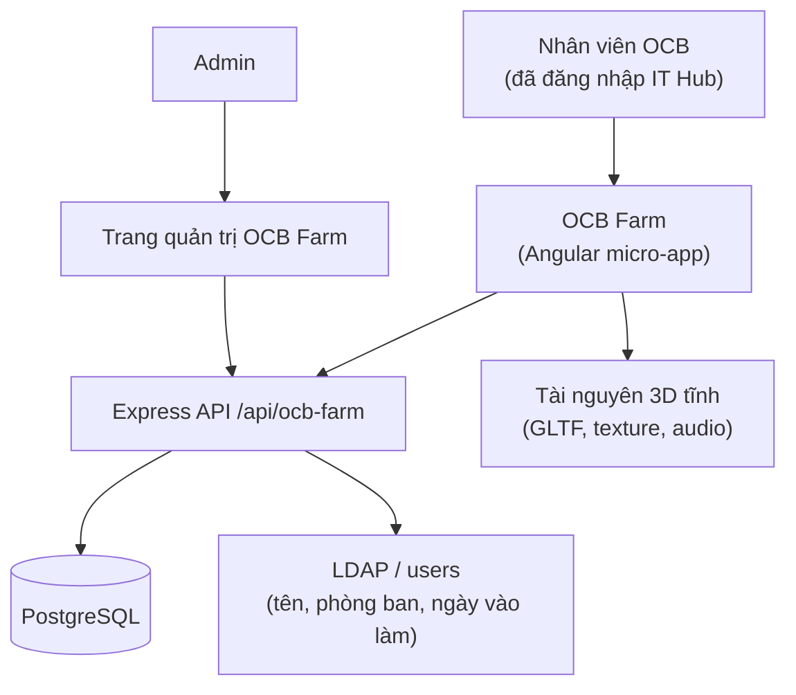
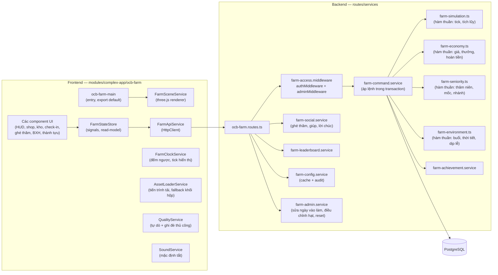
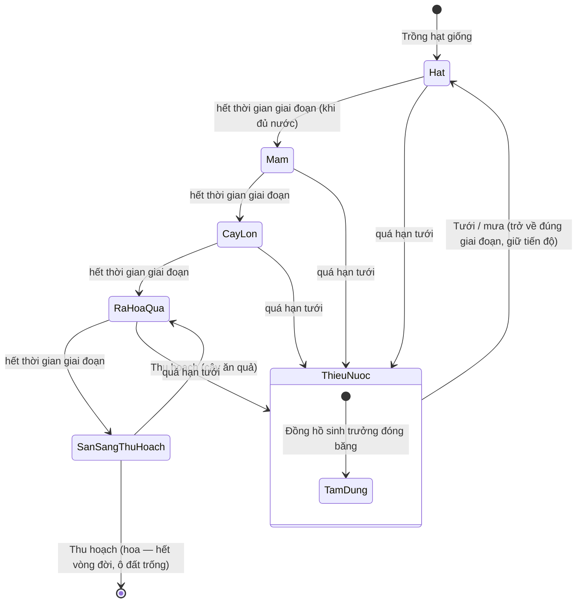
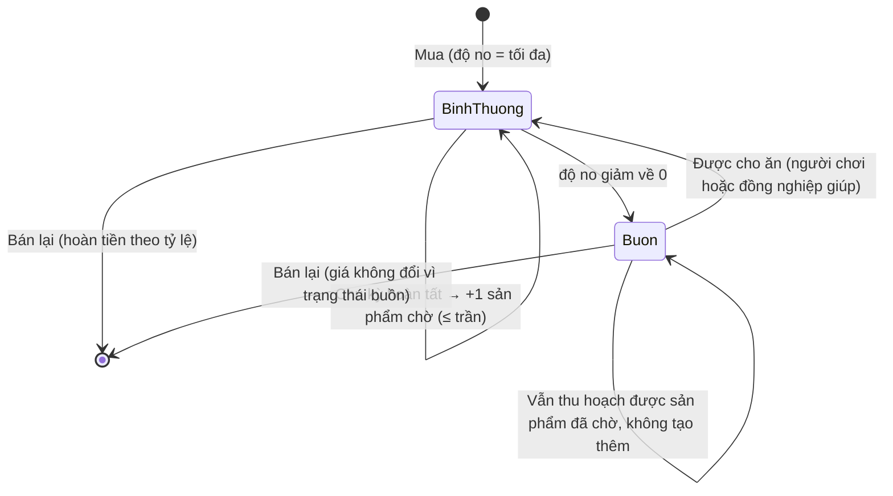
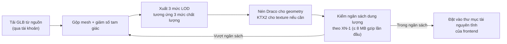
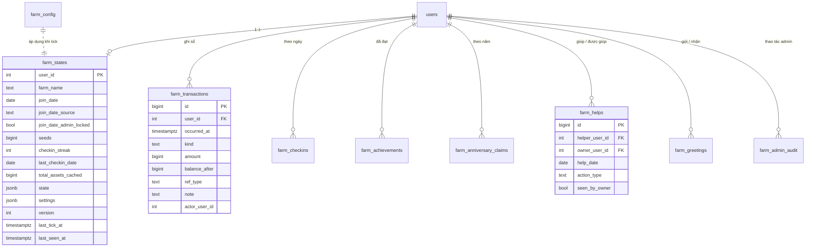

# Design Document — OCB Farm (Nông trại OCB)

## Overview

OCB Farm là một **complex-app** (theo `module-conventions.md`): cần bảng dữ liệu riêng, backend API, middleware phân quyền, nhiều màn hình và một khung render 3D. Vị trí:

- Frontend: `src/app/modules/complex-app/ocb-farm/`
- Backend: `backend/src/routes/ocb-farm.routes.ts`, `backend/src/services/ocb-farm/*`
- Admin: `src/app/pages/admin/admin-farm/`
- DB: các file `.sql` trong `backend/src/db/migrations/`
- Swagger: `backend/src/swagger/tags/ocb-farm.yaml`

### Nguyên tắc thiết kế cốt lõi

| # | Quyết định | Lý do |
|---|-----------|-------|
| D1 | **Server là nguồn chân lý (server-authoritative)**: mọi thay đổi trạng thái nông trại đi qua một endpoint lệnh duy nhất, server tự mô phỏng lại (tick) trước khi áp lệnh | Yêu cầu tích lũy offline (US-23), đa thiết bị (US-40), chống sửa dữ liệu ở client, và toàn bộ bất biến kinh tế (BR-9) chỉ có thể bảo đảm ở một nơi |
| D2 | **Mô phỏng thời gian là hàm thuần**: `simulate(state, fromTs, toTs, config) → state'` | Cho phép tính lại tiến trình bất kể người chơi online hay offline, và là điều kiện để viết property test |
| D3 | **Khóa lạc quan (optimistic lock) bằng `version`** trên mỗi nông trại | Xử lý AC "đã bán ở thiết bị khác" (US-22), "hai phiên cùng lúc" (US-40) mà không cần khóa bi quan |
| D4 | **Lưu trữ hỗn hợp**: cột quan hệ cho dữ liệu cần truy vấn/xếp hạng + một cột JSONB cho đồ thị thực thể của nông trại | Cân bằng giữa GD-4 (dữ liệu nhỏ, cấu trúc linh hoạt) và nhu cầu xếp hạng, lưu vết bất biến, ghi chéo giữa người dùng |
| D5 | **Thời tiết và buổi trong ngày là hàm thuần của thời gian** (không lưu bảng) | BR-30 buộc mọi nông trại giống nhau tại cùng thời điểm; hàm thuần cho kết quả giống nhau ở mọi tiến trình server |
| D6 | **Idempotency bằng khóa tự nhiên** (ngày check-in, năm kỷ niệm, cặp người-giúp/nông-trại/ngày, mã thành tựu) | Các AC "chỉ nhận một lần" (BR-6, BR-12, BR-13, BR-22) trở thành ràng buộc DB thay vì logic dễ hỏng |
| D7 | **Render 3D bằng `three` (đã có trong dependencies)**, camera trực giao isometric, 3 mức chất lượng | RB-1, US-36, US-38; không thêm dependency mới |
| D8 | **Toàn bộ mốc thời gian nghiệp vụ tính theo UTC+7** qua một module lịch dùng chung ở backend | Rất nhiều AC ràng buộc "00:00 giờ Việt Nam"; tập trung một chỗ để không lệch |
| D9 | **Dùng model 3D có sẵn theo giấy phép thương mại miễn phí, chỉ tự dựng những gì không tìm được** (thay vì tự dựng toàn bộ) | Số loại vật thể cần có (6 vật nuôi, 6 loại cây, hàng chục vật trang trí) quá lớn để tự dựng trong phạm vi dự án nội bộ; model web-ready có sẵn đã tối ưu số tam giác cho three.js, giúp đạt ngân sách dung lượng XN-1 và mức FPS ở RB-1 mà không phát sinh chi phí bản quyền |

### Sai lệch có chủ ý so với giả định GD-4

GD-4 đề xuất dùng `generic_storage` (bảng key-value JSONB dùng chung) cho toàn bộ dữ liệu. Thiết kế này **chỉ giữ tinh thần** của GD-4 (đồ thị thực thể nông trại nằm trong JSONB) nhưng tạo bảng riêng, vì `generic_storage` không đáp ứng được:

- **Ghi chéo giữa người dùng**: `storage.routes.ts` chặn ghi vào bản ghi của người khác (403), trong khi US-27 yêu cầu người ghé thăm làm thay đổi nông trại của chủ.
- **Lưu vết bất biến**: BR-27 yêu cầu dòng lưu vết không sửa/xoá được — `PUT`/`DELETE` của storage API cho phép ghi đè.
- **Xếp hạng và thống kê**: US-28, US-46 cần sắp xếp, lọc theo phòng ban, tổng hợp theo ngày.
- **Giới hạn 64KB/bản ghi** của storage API là rủi ro khi nông trại mở hết đất và đạt giới hạn vật phẩm.

> ⚠ Cần xác nhận: đồng ý sai lệch GD-4 theo hướng trên.

### Đề xuất chốt các điểm còn treo trong requirements

| Mã | Đề xuất của bước thiết kế | Trạng thái |
|----|--------------------------|-----------|
| XN-1 | Tổng tài nguyên 3D tải lần đầu ≤ 8 MB (gzip), thời gian chờ tối đa 30 giây rồi báo lỗi có nút thử lại | ⚠ Cần xác nhận |
| XN-2 | Lần đầu dùng nguồn LDAP/`users`; nếu không có trường ngày vào làm thì nhân viên tự khai (US-3 đã có nhánh dự phòng) | ⚠ Cần xác nhận |
| XN-3 | Bộ thông số khởi điểm ở mục "Cấu hình cân bằng game" bên dưới | ⚠ Cần xác nhận |
| XN-4 | Phiên bản đầu: Tết Nguyên đán, Giáng sinh, Trung thu, Sinh nhật OCB | ⚠ Cần xác nhận |
| XN-5 | Năm thành lập OCB = 1996 (chặn dưới cho ngày vào làm) | ⚠ Cần xác nhận |
| XN-6 | Ân hạn hái quả ngày kỷ niệm = 7 ngày kể từ hết ngày kỷ niệm | ⚠ Cần xác nhận |
| XN-7 | Ai đứng tên tài khoản tải tài nguyên 3D (tài khoản dùng chung của OCB Tech Team hay cá nhân) và nơi lưu file GLB (thư mục tài nguyên tĩnh của frontend hay CDN nội bộ) | ⚠ Cần xác nhận |

---

## Architecture

### Mức 1 — Bối cảnh



### Mức 2 — Thành phần



### Luồng lệnh chuẩn (mọi hành động thay đổi nông trại)

```mermaid
sequenceDiagram
    participant U as Nhân viên
    participant FE as FarmStateStore
    participant API as POST /api/ocb-farm/commands
    participant CMD as farm-command.service
    participant SIM as farm-simulation (thuần)
    participant DB as PostgreSQL

    U->>FE: Bấm hành động (cho ăn / thu hoạch / bán ...)
    FE->>FE: Cập nhật lạc quan + đưa lệnh vào hàng chờ
    FE->>API: { command, payload, version, idempotency_key }
    API->>CMD: xác thực quyền + schema
    CMD->>DB: BEGIN; SELECT ... FOR UPDATE
    CMD->>SIM: tick(state, last_tick_at → now)
    SIM-->>CMD: state đã cập nhật (độ no, sinh trưởng, tích lũy)
    CMD->>CMD: kiểm tra version khớp?
    alt version lệch
        CMD->>DB: ROLLBACK
        CMD-->>FE: 409 CONFLICT + state mới nhất
        FE->>U: Yêu cầu tải lại, hoàn tác cập nhật lạc quan
    else version khớp
        CMD->>CMD: áp lệnh + kiểm tra bất biến (số dư ≥ 0, giới hạn, ô đất)
        alt lệnh không hợp lệ
            CMD->>DB: ROLLBACK
            CMD-->>FE: 422 + mã lỗi nghiệp vụ
        else hợp lệ
            CMD->>DB: UPDATE farm_states (state, seeds, version+1)
            CMD->>DB: INSERT farm_transactions (nếu có thu/chi)
            CMD->>DB: INSERT farm_achievements (nếu đạt mốc)
            CMD->>DB: COMMIT
            CMD-->>FE: 200 { state, version, ledger_delta, achievements_unlocked }
        end
    end
```

### Vòng đời cây trồng



### Vòng đời vật nuôi



---

## Components and Interfaces

### Frontend — cấu trúc thư mục

```
src/app/modules/complex-app/ocb-farm/
├── ocb-farm-main.component.ts / .html / .scss   # export default, entry point
├── components/
│   ├── farm-canvas/            # khung 3D (three.js host), cử chỉ chuột/cảm ứng
│   ├── farm-hud/               # số Hạt OCB, thời tiết, buổi, huy hiệu, đếm vật phẩm/giới hạn
│   ├── onboarding-wizard/      # 5 bước hướng dẫn + nhập ngày vào làm (US-1..US-3)
│   ├── ocb-tree-panel/         # thông tin Cây OCB, thâm niên, mốc, dòng thời gian (US-4..US-7, US-51)
│   ├── shop-panel/             # 3 tab: vật nuôi / hạt giống / trang trí
│   ├── inventory-panel/        # kho + bán (US-22)
│   ├── ledger-panel/           # lịch sử thu chi phân trang (US-21)
│   ├── checkin-dialog/         # hộp thưởng check-in + chuỗi ngày (US-25)
│   ├── offline-summary-dialog/ # bảng tổng kết tích lũy khi vắng mặt (US-23)
│   ├── expand-panel/           # mở rộng vùng đất (US-24)
│   ├── visit-browser/          # danh sách + tìm/lọc nông trại đồng nghiệp (US-26)
│   ├── visit-toolbar/          # nhãn chế độ ghé thăm, giúp, gửi lời chúc (US-27, US-8)
│   ├── inbox-panel/            # người đã giúp + lời chúc, dấu "mới" (US-8, US-27)
│   ├── leaderboard-panel/      # 3 tiêu chí + lọc phòng ban (US-28)
│   ├── achievement-panel/      # danh sách thành tựu + chọn huy hiệu hiển thị (US-29)
│   ├── settings-panel/         # âm thanh, khoá cảnh, mức chất lượng (US-30, US-32, US-36)
│   ├── snapshot-button/        # chụp ảnh nông trại (US-41)
│   └── loading-overlay/        # tiến trình tải %, danh sách hạng mục lỗi (US-39)
├── models/
│   └── ocb-farm.model.ts       # kiểu dữ liệu dùng chung với backend (mirror của DTO)
└── services/
    ├── farm-api.service.ts     # gọi /api/ocb-farm, hàng chờ lệnh + thử lại
    ├── farm-state.store.ts     # signals: state, version, pending, lỗi
    ├── farm-scene.service.ts   # three.js: scene, camera isometric, instancing, LOD
    ├── asset-loader.service.ts # nạp GLTF theo mức chất lượng, fallback khối hộp
    ├── farm-clock.service.ts   # đồng hồ hiển thị (đếm ngược, đổi buổi) — không quyết định nghiệp vụ
    ├── quality.service.ts      # tự dò thiết bị + ghi đè thủ công + gợi ý hạ mức
    └── sound.service.ts        # nhạc nền / hiệu ứng, mặc định tắt
```

Quy ước bắt buộc: component chính dùng `export default`, standalone, `inject()`, signals, control flow `@if`/`@for`; toàn bộ UI ngoài khung 3D dùng class AdminLTE/Bootstrap (`.card`, `.btn`, `.badge`, `.modal`, `.nav-pills`, `.small-box`) theo RB-3; icon `bi bi-*`.

### Khung 3D — thiết kế render

| Hạng mục | Cách làm |
|----------|---------|
| Camera | `OrthographicCamera` góc isometric cố định; kéo để di chuyển, cuộn/chụm để phóng, 4 nút xoay 90° |
| Địa hình | Lưới ô vuông; mỗi vùng đất là một nhóm ô; ao nước là vùng riêng (chỉ nhận cá theo BR-18) |
| Vật thể | `InstancedMesh` theo từng loài/loại để giới hạn số draw call; mô hình GLTF nén Draco |
| 3 mức chất lượng | Cao: bóng đổ + hệ hạt + mô hình chi tiết. Vừa: bỏ bóng mềm, giảm hạt. Thấp: tắt bóng, tắt hạt, mô hình LOD thấp, giảm `devicePixelRatio` |
| Ngày/đêm | Đổi `DirectionalLight` + màu trời + cường độ bóng theo buổi; buổi đêm bật `PointLight` của vật phẩm trang trí là nguồn sáng |
| Thời tiết | Nắng / nhiều mây (giảm cường độ sáng) / mưa (hệ hạt + âm thanh nếu bật) |
| Chụp ảnh | Render một khung vào canvas ngoài luồng, vẽ overlay tên nông trại + tên nhân viên + thâm niên, xuất PNG tải về (US-41) |
| Mô hình lỗi | Khi một GLTF không tải được: đặt khối hộp có màu theo loại vào đúng ô, ghi vào danh sách "hạng mục tải lỗi", cho thử lại đúng hạng mục đó (US-39) |
| Di động | Bố cục điều khiển cảm ứng, vùng chạm ≥ 44×44 px, `touch-action: none` trên canvas để không cuộn trang (US-38) |

### Tài nguyên 3D — nguồn và pipeline

Theo D9, nông trại **không tự dựng toàn bộ model**. Phần lớn vật thể lấy từ thư viện model miễn phí có giấy phép thương mại, chỉ tự dựng những gì bản chất không thể tìm sẵn.

#### Nguồn chính

| Hạng mục | Nội dung |
|----------|---------|
| Nguồn | https://threejsassets.com — thư viện model web-ready dành riêng cho three.js, khoảng 721 model miễn phí (vật nuôi, cây cối, vật trang trí, nhà, đồ nông trại) |
| Giấy phép | Free Commercial License: được dùng trong dự án thương mại và nội bộ, được sửa đổi model, **không cần ghi công**; chỉ cần một tài khoản miễn phí để tải file |
| Được phép | Serve model như một phần của web app OCB IT Hub (kể cả bản đã sửa đổi, đã giảm tam giác, đã nén) — nằm trong phạm vi giấy phép |
| Bị cấm | Bán lại, phát tán hoặc mirror **bản thân file GLB**; đóng gói lại thành một asset pack khác để phân phối |
| Giới hạn thực hành | Bản xem trước trên web của nhà cung cấp chỉ dùng để **đánh giá** model có phù hợp hay không; file thật phải tải về qua tài khoản, không được nhúng trực tiếp từ trang nguồn |

#### Nguồn dự phòng

Với loại vật thể mà nguồn chính không có, dùng các thư viện CC0 tương đương: **3dassets.dev**, **Numinia**, **Poly Haven**.

Nguyên tắc nhận asset (áp dụng cho mọi nguồn):

- Chỉ nhận asset có giấy phép **cho phép dùng thương mại**.
- Ưu tiên giấy phép **không cần ghi công**; nếu giấy phép bắt buộc ghi công thì phải ghi công được ở trang trợ giúp của app — nếu không đặt được ghi công thì loại asset đó.
- Không nhận asset có điều khoản "chỉ dùng phi thương mại", "chỉ dùng cá nhân", hoặc yêu cầu chia sẻ lại mã nguồn.

#### Phần phải tự dựng

| Hạng mục | Vì sao không tìm sẵn được | Cách dựng |
|----------|--------------------------|-----------|
| Cây OCB | Hình dạng phụ thuộc số nhánh theo thâm niên (BR-2, BR-3, US-5..US-7) nên mỗi nhân viên có một cây khác nhau — không tồn tại model tĩnh nào khớp | Lắp ghép nhánh theo tham số: một thân + một mẫu nhánh + một mẫu tán lá, nhân bản và đặt góc theo số nhánh mà module thâm niên trả về |
| Lưới ô đất | Là hình học sinh ra theo cấu hình vùng đất đã mở, không phải model nghệ thuật | Sinh hình học tại chỗ theo kích thước ô và danh sách vùng |
| Ao nước | Phải khớp chính xác với các ô địa hình `water` của lưới (BR-18) | Sinh mặt nước theo vùng ô, dùng vật liệu trong suốt |
| Khối hộp fallback | Là hình đại diện khi model thật tải lỗi (US-39) | Khối hộp cơ bản, màu theo loại vật thể |

#### Pipeline xử lý tài nguyên



- Bước giảm tam giác chạy trước khi nén, để mức LOD thấp thật sự nhẹ chứ không chỉ nén chặt hơn.
- Ba mức LOD tương ứng đúng 3 mức chất lượng ở bảng trên: cao / vừa / thấp.
- Texture chỉ chuyển KTX2 khi tổng dung lượng còn vượt ngân sách — với model low-poly thường không cần.
- Bước kiểm ngân sách là điều kiện chặn: tài nguyên không đạt XN-1 thì không được đưa vào thư mục tĩnh.

#### Manifest tài nguyên

Một file khai báo duy nhất ánh xạ **mã loài / mã loại vật phẩm → đường dẫn GLB theo từng mức chất lượng**. File này:

- Là **nguồn chân lý duy nhất** về danh sách tài nguyên của nông trại: không có mã nào được render nếu chưa khai báo trong manifest.
- Được `AssetLoaderService` dùng để biết cần nạp file nào ở mức chất lượng hiện tại, và biết mã nào rơi vào khối hộp fallback khi tải lỗi (US-39).
- Được bước kiểm ngân sách dùng để liệt kê đúng tập file tính vào tổng dung lượng tải lần đầu (XN-1) — hai bên đọc cùng một danh sách nên không lệch.

#### Ghi nhận giấy phép

Một file kê khai lưu trong repo, mỗi dòng ứng với một asset: tên asset, nguồn tải, tên giấy phép, ngày tải, có yêu cầu ghi công hay không, và mã loài/loại tương ứng trong manifest. Mục đích: phục vụ rà soát tuân thủ của ngân hàng — khi được hỏi "model này ở đâu ra, dùng có đúng giấy phép không" thì trả lời được ngay mà không phải tra lại trang nguồn. Asset tự dựng cũng ghi vào file này, ghi rõ là sản phẩm nội bộ.

### Backend — API

Tất cả route nằm dưới `/api/ocb-farm`, đăng ký trong `backend/src/index.ts`. Chuỗi middleware: `authMiddleware` → `farmAccessMiddleware` (kiểm tra quyền app theo BR-25) → handler. Nhóm `/admin/*` thêm `adminMiddleware` (BR-26).

| Method | Path | Mô tả | AC chính |
|--------|------|-------|----------|
| GET | `/config` | Cấu hình cân bằng game đang áp dụng (để client hiển thị giá, thời gian) | US-45 |
| GET | `/me` | Nông trại của tôi sau khi server tick; kèm `version`, bảng tổng kết offline, trạng thái check-in, buổi, thời tiết, dịp lễ | US-21, US-23, US-25, US-30, US-31, US-33 |
| POST | `/me/init` | Khởi tạo nông trại + xác nhận ngày vào làm (idempotent theo `user_id`) | US-1, US-2, US-3 |
| GET | `/me/join-date-suggestion` | Tra ngày vào làm từ nguồn nhân sự (có timeout) | US-3 |
| POST | `/commands` | Endpoint lệnh duy nhất cho mọi hành động thay đổi nông trại | US-10..US-25, US-34, US-35 |
| GET | `/me/ledger` | Lịch sử thu chi, phân trang | US-21 |
| GET | `/me/achievements` | Toàn bộ thành tựu + tiến trình | US-29 |
| GET | `/me/inbox` | Người đã giúp + lời chúc, kèm cờ "mới" | US-8, US-27 |
| POST | `/me/inbox/read` | Đánh dấu đã xem (xoá cờ "mới") | US-27 |
| GET | `/farms` | Danh sách nông trại để ghé thăm (`q`, `department_id`, phân trang) | US-26 |
| GET | `/farms/:userId` | Nông trại đồng nghiệp ở dạng chỉ-xem (đã lọc dữ liệu riêng tư) | US-26 |
| POST | `/farms/:userId/help` | Giúp tưới cây / cho ăn | US-27 |
| POST | `/farms/:userId/greeting` | Gửi lời chúc / biểu cảm | US-8, US-48 |
| GET | `/leaderboard` | `metric=seniority\|assets\|streak`, `department_id` | US-28 |
| GET | `/admin/users` | Tìm nhân viên theo tên / phòng ban | US-42 |
| PATCH | `/admin/users/:id/join-date` | Sửa ngày vào làm + lưu vết | US-42 |
| POST | `/admin/users/:id/seeds` | Điều chỉnh Hạt OCB (bắt buộc `reason`, `Idempotency-Key`) | US-43 |
| POST | `/admin/users/:id/reset` | Đặt lại nông trại (xác nhận 2 bước ở UI, 1 lệnh ở API) | US-44 |
| GET/PUT | `/admin/config` | Đọc/ghi thông số cân bằng + lưu vết | US-45 |
| GET | `/admin/stats` | Thống kê sử dụng, lọc phòng ban | US-46 |
| GET | `/admin/audit` | Xem dòng lưu vết (chỉ đọc) | BR-27 |

### Danh mục lệnh của `POST /commands`

```
Nông trại của tôi:
  BUY_ANIMAL, FEED_ANIMAL, FEED_ALL, HARVEST_ANIMAL, HARVEST_ALL,
  MOVE_ENTITY, SELL_ANIMAL,
  PLANT_SEED, WATER_PLANT, WATER_ALL, FERTILIZE_PLANT, HARVEST_PLANT,
  SELL_PRODUCT, EXPAND_PLOT,
  BUY_DECOR, MOVE_DECOR, ROTATE_DECOR, SELL_DECOR, RENAME_FARM,
  CLAIM_CHECKIN, PICK_ANNIVERSARY_FRUIT, SELECT_BADGES, UPDATE_SETTINGS
```

Mỗi request gồm: `{ command, payload, version, idempotency_key }`. Response 200 trả `{ state, version, balance, ledger_delta[], achievements_unlocked[], notices[] }`. Response 409 kèm state mới nhất để client tự hoà giải.

### Module hàm thuần ở backend (nơi tập trung logic có thể kiểm chứng)

| Module | Hàm chính | Trách nhiệm |
|--------|-----------|-------------|
| `farm-calendar.ts` | `nowVN()`, `startOfDayVN()`, `addMonthsClamped()`, `anniversaryOf()` | Mọi phép tính mốc ngày theo UTC+7, kẹp ngày cuối tháng, quy tắc 29/02 → 28/02 |
| `farm-seniority.ts` | `seniority(joinDate, now)`, `milestoneIndex()`, `branchCount()`, `daysToNextMilestone()` | US-5, US-6, US-7, BR-2, BR-3 |
| `farm-simulation.ts` | `tick(state, fromTs, toTs, config, weatherTimeline)` | Giảm độ no, tiến trình sinh trưởng, tích lũy sản phẩm có trần, mưa tự tưới |
| `farm-economy.ts` | `sellPrice()`, `horseBonus()`, `refund()`, `applyBalance()` | Giá bán, thưởng ngựa có mức trần, hoàn tiền, chặn số dư âm |
| `farm-environment.ts` | `dayPhaseAt(ts)`, `weatherAt(ts, seed)`, `seasonThemeAt(date)` | US-30, US-31, US-33, BR-30 |
| `farm-grid.ts` | `canPlace(state, cell, kind)` | Ô trung tâm bất khả xâm phạm, địa hình, vùng đã mở, ô đã bị chiếm |
| `farm-achievement.ts` | `evaluate(state, counters, config)` | Trả về danh sách mã thành tựu vừa đạt |
| `farm-checkin.ts` | `nextStreak(lastDate, today)`, `milestoneReward(streak)` | US-25, BR-13, BR-14 |

---

## Data Models

### ER



### Bảng và file migration

Theo `project-overview.md`, mỗi bảng là **một file `.sql` riêng, idempotent (`IF NOT EXISTS`)** trong `backend/src/db/migrations/`:

| File | Nội dung |
|------|----------|
| `YYYYMMDD_001_create_farm_states.sql` | Trạng thái nông trại (1 dòng / nhân viên) |
| `YYYYMMDD_002_create_farm_transactions.sql` | Sổ thu chi, append-only |
| `YYYYMMDD_003_create_farm_checkins.sql` | Check-in theo ngày, `UNIQUE(user_id, checkin_date)` |
| `YYYYMMDD_004_create_farm_achievements.sql` | Thành tựu đã đạt, `UNIQUE(user_id, achievement_code)` |
| `YYYYMMDD_005_create_farm_anniversary_claims.sql` | Hái quả kỷ niệm, `UNIQUE(user_id, anniversary_year)` |
| `YYYYMMDD_006_create_farm_helps.sql` | Lượt giúp, `UNIQUE(helper_user_id, owner_user_id, help_date)` |
| `YYYYMMDD_007_create_farm_greetings.sql` | Lời chúc / biểu cảm |
| `YYYYMMDD_008_create_farm_config.sql` | Thông số cân bằng game (key, value, unit, min, max) |
| `YYYYMMDD_009_create_farm_admin_audit.sql` | Lưu vết thao tác admin, chỉ INSERT |
| `YYYYMMDD_010_seed_farm_config.sql` | Bộ thông số khởi điểm |
| `YYYYMMDD_011_seed_apps_ocb_farm.sql` | Bản ghi app (dự phòng cho môi trường không chạy auto-sync) |

Ràng buộc mức DB quan trọng:

- `farm_states.seeds BIGINT NOT NULL DEFAULT 0 CHECK (seeds >= 0)` — biến BR-9 thành bất biến của DB.
- `farm_states.version INT NOT NULL DEFAULT 0` — khóa lạc quan.
- `farm_transactions` không có route `UPDATE`/`DELETE`; `farm_admin_audit` cũng vậy (BR-27).
- Index: `farm_states(join_date)`, `farm_states(total_assets_cached DESC)`, `farm_states(checkin_streak DESC)` cho 3 tiêu chí xếp hạng; `farm_transactions(user_id, occurred_at DESC)`; `farm_helps(owner_user_id, help_date)`.

### Hình dạng JSONB `farm_states.state`

```
{
  "schema": 1,
  "plots":   [ { "id", "unlocked", "cells": ["r,c", ...], "terrain": "land|water" } ],
  "animals": [ { "id", "species", "cell", "fed_at", "fullness", "cycle_started_at", "pending" } ],
  "plants":  [ { "id", "kind", "cell", "stage", "stage_elapsed_ms", "watered_at",
                 "fertilized_stage", "ready_at" } ],
  "decors":  [ { "id", "kind", "cell", "rotation", "is_light", "seasonal_tag" } ],
  "storage": { "egg": 0, "milk": 0, "wool": 0, "fish": 0, "manure": 0, "fruit_*": 0, "flower_*": 0 },
  "tree":    { "milestone", "branches", "last_evaluated_at" },
  "badges_shown": ["code", ...],
  "counters": { "harvest_count", "water_count", "help_given", "species_owned": [...] }
}
```

`settings`: `{ "quality": "low|medium|high", "quality_manual": bool, "bgm": false, "sfx": false, "scene_lock": null|"morning|noon|afternoon|night" }` — âm thanh mặc định tắt theo BR-29, và được lưu theo nhân viên nên giữ nguyên khi đổi thiết bị (US-32, US-36).

### Cấu hình cân bằng game (đề xuất khởi điểm — XN-3)

| Nhóm | Khóa | Giá trị đề xuất | Đơn vị |
|------|------|-----------------|--------|
| Khởi tạo | `initial_seeds` | 500 | Hạt OCB |
| Cây OCB | `ocb_founded_year` | 1996 | năm |
| Cây OCB | `tree_max_milestone` | 40 (20 năm) | mốc |
| Cây OCB | `tree_max_branches` | 30 | nhánh |
| Cây OCB | `anniversary_fruit_count` / `anniversary_reward` | 5 / 500 | quả / Hạt OCB |
| Cây OCB | `anniversary_grace_days` | 7 | ngày |
| Vật nuôi | `animal_price` gà/cá/cừu/heo/bò/ngựa | 100 / 150 / 250 / 300 / 500 / 800 | Hạt OCB |
| Vật nuôi | `feed_cost` | 10% giá mua | Hạt OCB |
| Vật nuôi | `fullness_decay` | 100 → 0 trong 24 giờ | %/giờ |
| Vật nuôi | `produce_cycle` gà/bò/cừu/cá/heo | 2 / 4 / 8 / 3 / 6 | giờ |
| Vật nuôi | `offline_cap_per_entity` | 5 | sản phẩm |
| Vật nuôi | `horse_bonus_per_horse` / `horse_bonus_max` | 5% / 25% | % giá bán |
| Cây trồng | `seed_price` / `grow_total` (3 quả, 3 hoa) | 50–200 / 8–36 | Hạt OCB / giờ |
| Cây trồng | `water_interval` | 8 | giờ |
| Cây trồng | `fertilize_reduction` | 30% thời gian còn lại | % |
| Kho | `storage_cap` | 500 | đơn vị |
| Kinh tế | `resell_ratio` | 50% | % giá mua |
| Đất | `expand_price` vùng 2..6 | 1.000 / 2.500 / 5.000 / 10.000 / 20.000 | Hạt OCB |
| Check-in | `checkin_reward` | 100 | Hạt OCB |
| Check-in | `streak_bonus` mốc 3/7/14/30 | 200 / 500 / 1.200 / 3.000 | Hạt OCB |
| Giúp đỡ | `help_quota_per_day` / `help_reward_each` | 10 / 50 | lượt / Hạt OCB |
| Giới hạn | `max_animals` / `max_plants` / `max_decors` | 30 / 40 / 60 | vật phẩm |
| Môi trường | `weather_cycle` | 60 | phút |
| Môi trường | `day_phase` sáng/trưa/chiều/đêm | 05–11 / 11–14 / 14–18 / 18–05 | giờ VN |
| Hiệu năng | `fps_floor` / `fps_low_window` | 25 / 30 | fps / giây |
| Khác | `farm_name_max_len` / `rename_quota` | 40 / 3 lần mỗi 7 ngày | ký tự / lần |
| Khác | `greeting_max_len` | 200 | ký tự |
| Khác | `admin_adjust_max` / `admin_reason_min_len` | 100.000 / 10 | Hạt OCB / ký tự |
| Xếp hạng | `leaderboard_refresh` | 5 | phút |

### Đăng ký app (bắt buộc)

| Việc | File | Nội dung |
|------|------|---------|
| Lazy load component | `src/app/core/registry/app-registry.ts` | `{ id: 'ocb-farm', name: 'Nông trại OCB', route: 'modules/ocb-farm', category: 'Khác', author: 'OCB Tech Team', loadComponent: () => import('../../modules/complex-app/ocb-farm/ocb-farm-main.component') }` |
| Đồng bộ DB | `backend/src/config/apps-catalog.ts` | cùng entry + `access_mode: 'restricted'` (BR-25) |
| Tên trong analytics | `src/app/pages/admin/admin-analytics/admin-analytics.component.ts` | thêm vào `pageNames` (`/modules/ocb-farm`, `/admin/farm`) và `appNames` (`ocb-farm`) |
| Route có guard | `src/app/app.routes.ts` | `modules/ocb-farm` + `admin/farm`, cả hai `canActivate: [authGuard]` trong children của `LayoutShell` |
| Sidebar | `src/app/core/layout/sidebar/nav-config.ts` | `Nông trại OCB` (`bi bi-tree`) cho mọi user; `Quản lý → Nông trại OCB` với `roles: ['admin']` |
| Swagger | `backend/src/swagger/tags/ocb-farm.yaml` + `index.ts` | mọi endpoint ở bảng API trên, schema dùng chung đưa vào `components/schemas.yaml` |
| Theo dõi sử dụng | `ocb-farm-main.component.ts` | `analytics.trackAppUsage('ocb-farm', 'farm_action')` ở hành động chính (check-in / thu hoạch) |
